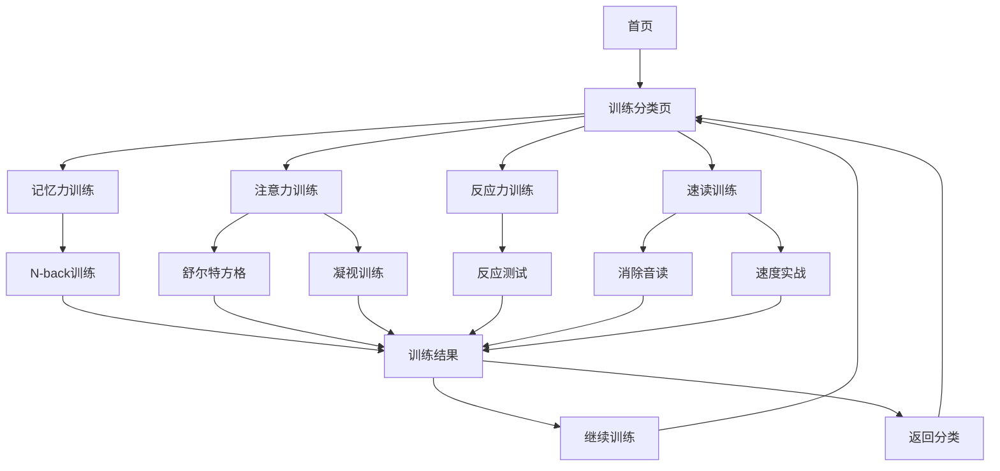

# Brain Train 产品需求文档

## 1. 产品概述

Brain Train 是一款基于 Next.js 14 构建的现代化大脑训练应用，专注于提升用户的认知能力。通过科学设计的训练模块，帮助用户改善记忆力、注意力、反应力和阅读速度等核心认知技能。

产品采用沉浸式星空主题设计，结合动漫风格的视觉元素和舒缓的背景音乐，为用户创造愉悦的训练体验。支持9种语言的国际化功能，满足全球用户的使用需求。

## 2. 核心功能

### 2.1 用户角色

| 角色 | 注册方式 | 核心权限 |
|------|----------|----------|
| 游客用户 | 无需注册 | 可体验所有训练模块，但无法保存进度 |
| 注册用户 | 邮箱注册 | 可保存训练记录、查看统计数据、个性化设置 |

### 2.2 功能模块

我们的大脑训练应用包含以下主要页面：

1. **首页**：星空背景展示、产品介绍、快速开始按钮
2. **训练分类页**：记忆力、注意力、反应力、速读四大训练类别
3. **具体训练页面**：各种训练游戏的实际操作界面
4. **统计页面**：个人训练数据分析和进度展示
5. **设置页面**：语言切换、主题设置、音乐控制

### 2.3 页面详情

| 页面名称 | 模块名称 | 功能描述 |
|----------|----------|----------|
| 首页 | 星空背景展示 | 动态星空背景动画，营造沉浸式体验氛围 |
| 首页 | 产品介绍区 | 展示产品核心价值和训练效果，引导用户开始训练 |
| 首页 | 快速开始 | 一键进入训练模式，降低用户使用门槛 |
| 训练分类页 | 记忆力训练 | N-back流动记忆训练，提升工作记忆能力 |
| 训练分类页 | 注意力训练 | 舒尔特方格、凝视训练，增强专注力和视觉搜索能力 |
| 训练分类页 | 反应力训练 | 快速反应测试，提升反应速度和手眼协调 |
| 训练分类页 | 速读训练 | 消除音读、速度实战，提高阅读效率 |
| 舒尔特方格页 | 数字网格 | 3x3数字方格，按顺序点击数字1-9 |
| 舒尔特方格页 | 计时系统 | 实时计时显示，记录最佳成绩 |
| 舒尔特方格页 | 成绩统计 | 显示当前用时和历史最佳记录 |
| N-back训练页 | 记忆序列 | 动态显示需要记忆的刺激序列 |
| N-back训练页 | 判断机制 | 用户判断当前刺激是否与N步前相同 |
| 凝视训练页 | 注视点 | 屏幕中央固定黑点，训练持续注意力 |
| 凝视训练页 | 干扰元素 | 可选添加干扰因素，增加训练难度 |
| 设置页面 | 语言切换 | 支持中文、英文、日文等9种语言 |
| 设置页面 | 主题设置 | 多种主题色彩方案选择 |
| 设置页面 | 音乐控制 | 背景音乐开关和音量调节 |

## 3. 核心流程

**游客用户流程：**
用户访问首页 → 选择训练类别 → 进入具体训练 → 完成训练查看结果 → 可选择继续训练或切换模块

**注册用户流程：**
用户登录 → 查看个人统计 → 选择训练模块 → 完成训练 → 数据自动保存 → 查看进步趋势

## 4. 用户界面设计

### 4.1 设计风格

- **主色调**：深蓝星空背景 (#010112)，青色高亮 (#00ffff)
- **辅助色彩**：薄荷绿 (#00d8fe)，粉色 (#f81ce5)，紫色 (#8c00ff)
- **按钮样式**：圆角设计，渐变色背景，点击时弹性动画效果
- **字体风格**：Space Grotesk 现代感字体，支持多语言显示
- **布局风格**：卡片式设计，居中对齐，响应式网格布局
- **图标风格**：线性图标配合动漫风格插图，星星、云朵等装饰元素

### 4.2 页面设计概览

| 页面名称 | 模块名称 | UI元素 |
|----------|----------|--------|
| 首页 | 星空背景 | 动态旋转星空图片，CSS动画240s循环，营造梦幻氛围 |
| 首页 | 标题区域 | 大号渐变文字效果，霓虹灯光晕，3D文字阴影 |
| 首页 | 开始按钮 | 青色渐变背景，圆角设计，悬停时发光效果 |
| 训练页面 | 卡片容器 | 半透明白色背景，圆角阴影，毛玻璃效果 |
| 训练页面 | 计时器 | 大号数字显示，青色高亮，实时更新动画 |
| 训练页面 | 游戏区域 | 网格布局，按钮点击反馈，状态颜色变化 |
| 设置页面 | 控制面板 | 开关组件，滑块控制，下拉选择器 |
| 音乐播放器 | 浮动控件 | 固定定位，圆形按钮，播放状态指示 |

### 4.3 响应式设计

产品采用移动优先的响应式设计策略，确保在手机、平板、桌面设备上都有良好的用户体验。针对触摸设备优化了按钮大小和交互区域，支持手势操作和触摸反馈。