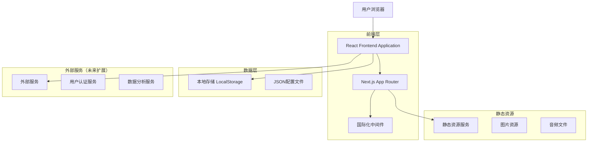

# Brain Train 技术架构文档

## 1. 架构设计

## 2. 技术描述

- **前端框架**: React@18 + Next.js@14 + TypeScript@5.3
- **样式方案**: TailwindCSS@3.4 + 自定义CSS动画
- **UI组件库**: Radix UI + shadcn/ui 设计系统
- **国际化**: next-intl@3.11 支持9种语言
- **状态管理**: React Hooks + 本地存储
- **构建工具**: Vite + PostCSS + Autoprefixer
- **开发工具**: ESLint + Prettier + TypeScript
- **部署平台**: Vercel（推荐）

## 3. 路由定义

| 路由 | 用途 |
|------|------|
| /[locale] | 多语言首页，展示产品介绍和快速开始 |
| /[locale]/attention | 注意力训练分类页面 |
| /[locale]/memory