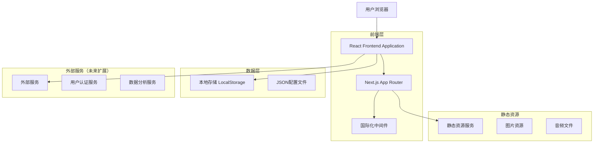
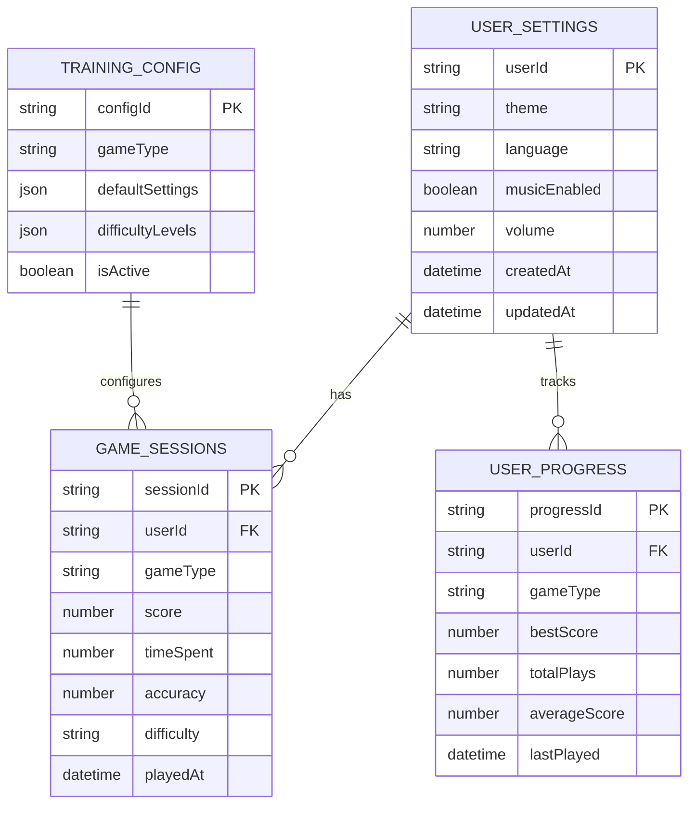

# Brain Train 技术架构文档

## 1. 架构设计



## 2. 技术描述

- **前端框架**: React@18 + Next.js@14 + TypeScript@5.3
- **样式方案**: TailwindCSS@3.4 + 自定义CSS动画
- **UI组件库**: Radix UI + shadcn/ui 设计系统
- **国际化**: next-intl@3.11 支持9种语言
- **状态管理**: React Hooks + 本地存储
- **构建工具**: Vite + PostCSS + Autoprefixer
- **开发工具**: ESLint + Prettier + TypeScript
- **部署平台**: Vercel（推荐）

## 3. 路由定义

| 路由 | 用途 |
|------|------|
| /[locale] | 多语言首页，展示产品介绍和快速开始 |
| /[locale]/attention | 注意力训练分类页面 |
| /[locale]/memory | 记忆力训练分类页面 |
| /[locale]/reaction | 反应力训练分类页面 |
| /[locale]/speedreading | 速读训练分类页面 |
| /[locale]/categories | 所有训练类别总览页面 |
| /[locale]/train/schulte | 舒尔特方格训练游戏 |
| /[locale]/train/n-back | N-back记忆训练游戏 |
| /[locale]/train/gaze | 凝视专注力训练 |
| /[locale]/train/reading-elimination | 消除音读训练 |
| /[locale]/train/speed-practice | 速读实战练习 |
| /[locale]/about | 关于页面，产品介绍和使用说明 |

## 4. 组件架构

### 4.1 核心组件结构

```typescript
// 主要组件类型定义
interface TrainingGameProps {
  locale: string;
  onComplete: (score: number, time: number) => void;
  difficulty?: 'easy' | 'medium' | 'hard';
}

interface GameResult {
  score: number;
  time: number;
  accuracy: number;
  timestamp: Date;
}

interface UserProgress {
  gameType: string;
  bestScore: number;
  totalPlays: number;
  averageScore: number;
  lastPlayed: Date;
}
```

### 4.2 状态管理模式

```typescript
// 使用 React Context 进行全局状态管理
interface AppContextType {
  // 用户设置
  theme: string;
  language: string;
  musicEnabled: boolean;
  
  // 训练数据
  userProgress: Record<string, UserProgress>;
  currentSession: GameResult | null;
  
  // 操作方法
  updateProgress: (gameType: string, result: GameResult) => void;
  updateSettings: (settings: Partial<UserSettings>) => void;
}
```

## 5. 数据模型

### 5.1 数据模型定义



### 5.2 本地存储数据结构

```typescript
// LocalStorage 数据结构
interface LocalStorageData {
  // 用户设置
  userSettings: {
    theme: string;
    language: string;
    musicEnabled: boolean;
    volume: number;
  };
  
  // 训练进度
  gameProgress: {
    [gameType: string]: {
      bestScore: number;
      bestTime: number;
      totalPlays: number;
      recentScores: number[];
      lastPlayed: string;
    };
  };
  
  // 会话数据
  sessionHistory: {
    date: string;
    sessions: GameResult[];
  }[];
}
```

## 6. 性能优化策略

### 6.1 前端性能优化

- **代码分割**: 使用 Next.js 动态导入，按路由分割代码
- **图片优化**: 使用 Next.js Image 组件，支持 WebP 格式和懒加载
- **CSS优化**: TailwindCSS 的 purge 功能移除未使用样式
- **缓存策略**: 静态资源使用浏览器缓存，API 数据使用 SWR
- **预加载**: 关键路由和资源的预加载

### 6.2 用户体验优化

- **加载状态**: 所有异步操作都有加载指示器
- **错误处理**: 优雅的错误边界和用户友好的错误提示
- **离线支持**: Service Worker 缓存关键资源
- **响应式设计**: 移动端优先的响应式布局
- **无障碍访问**: ARIA 标签和键盘导航支持

### 6.3 资源优化

```typescript
// 图片资源优化配置
const imageOptimization = {
  formats: ['webp', 'avif'],
  sizes: [640, 768, 1024, 1280, 1600],
  quality: 85,
  loading: 'lazy' as const,
};

// 音频资源优化
const audioOptimization = {
  formats: ['ogg', 'mp3'],
  bitrate: '128k',
  preload: 'metadata' as const,
};
```

## 7. 部署和运维

### 7.1 构建配置

```javascript
// next.config.js 优化配置
module.exports = {
  // 图片优化
  images: {
    domains: ['localhost'],
    formats: ['image/webp', 'image/avif'],
  },
  
  // 国际化配置
  i18n: {
    locales: ['en', 'zh', 'ja', 'de', 'fr', 'es', 'ar', 'fa', 'ko', 'pl', 'pt', 'ru'],
    defaultLocale: 'en',
  },
  
  // 性能优化
  experimental: {
    optimizeCss: true,
    optimizeImages: true,
  },
  
  // 压缩配置
  compress: true,
  
  // PWA 支持
  pwa: {
    dest: 'public',
    register: true,
    