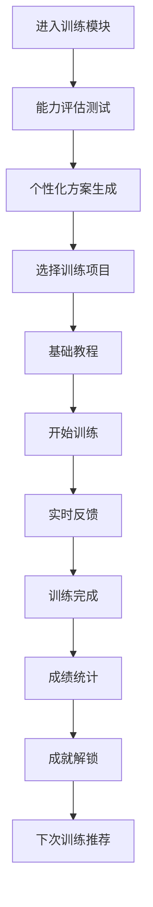
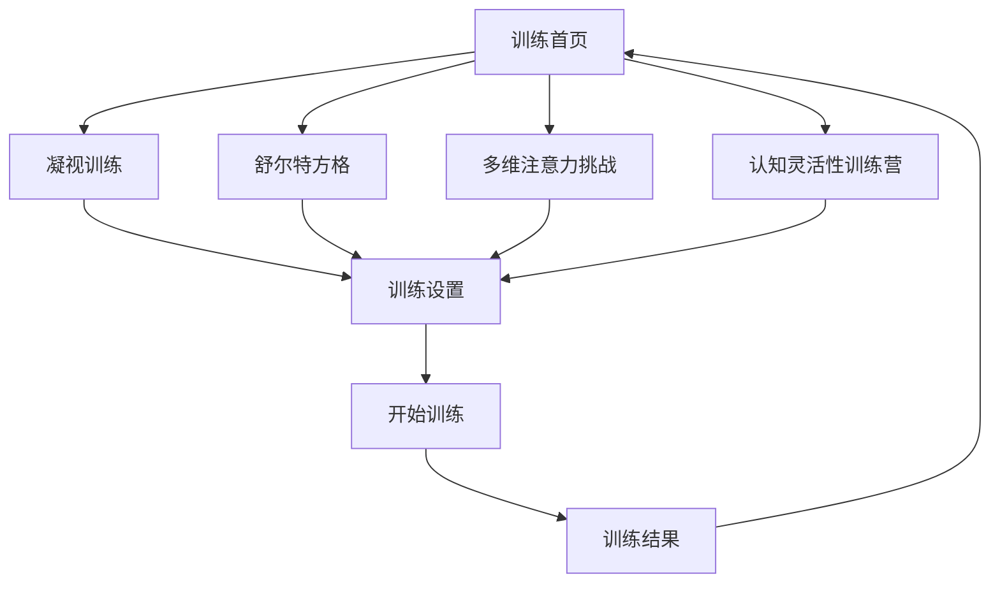
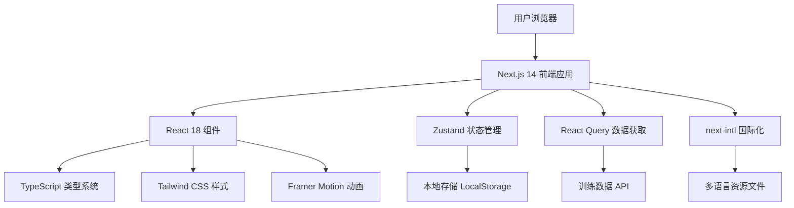

# 四大注意力训练项目产品需求文档

## 1. 产品概述

基于脑力训练平台市场调研与产品策略规划，本文档详细设计四个核心注意力训练项目：凝视训练、舒尔特方格、多维注意力挑战和认知灵活性训练营。这些项目旨在通过科学化、游戏化的训练方式，全面提升用户的注意力水平，满足不同用户群体的训练需求。

**设计原则：**
- 易用性：界面直观，操作简洁，用户能够轻松上手
- 好用性：功能设计符合用户习惯，提供流畅高效的使用体验
- 科学性：基于认知科学理论，确保训练效果的有效性
- 趣味性：游戏化设计，提升用户参与度和持续性

## 2. 核心功能设计

### 2.1 功能模块概览

本产品包含以下四个主要训练项目：

1. **凝视训练**：专注力集中训练，通过视觉焦点锻炼持续注意力
2. **舒尔特方格**：视觉搜索与注意力分配训练，提升注意力广度和转换能力
3. **多维注意力挑战**：综合性注意力训练，结合视觉、听觉、触觉多感官刺激
4. **认知灵活性训练营**：认知切换与适应性训练，提升思维灵活性和执行控制能力

### 2.2 页面详细设计

| 页面名称 | 模块名称 | 功能描述 |
|----------|----------|----------|
| 凝视训练页面 | 训练界面 | 显示凝视目标，记录凝视时长和稳定性，提供实时反馈 |
| 凝视训练页面 | 设置面板 | 调整训练难度、时长、背景干扰等参数 |
| 凝视训练页面 | 进度统计 | 展示训练历史、能力提升曲线、成就解锁 |
| 舒尔特方格页面 | 方格界面 | 动态生成数字方格，支持多种规格和难度 |
| 舒尔特方格页面 | 计时系统 | 精确计时，记录完成速度和准确率 |
| 舒尔特方格页面 | 排行榜 | 个人最佳成绩、好友对比、全球排名 |
| 多维注意力页面 | 综合训练区 | 多感官刺激呈现，任务切换和并行处理 |
| 多维注意力页面 | 自适应系统 | AI算法实时调整难度，个性化训练方案 |
| 多维注意力页面 | 数据分析 | 多维度能力评估，详细的表现分析报告 |
| 认知灵活性页面 | 任务切换区 | 规则变化训练，认知控制能力测试 |
| 认知灵活性页面 | 情境模拟 | 真实场景模拟，实用技能训练 |
| 认知灵活性页面 | 进阶挑战 | 高难度综合测试，无尽模式挑战 |

## 3. 核心训练流程

### 3.1 用户训练路径

**新用户引导流程：**


**训练项目间导航：**


### 3.2 训练项目详细流程

**凝视训练流程：**
1. 选择训练模式（静态凝视、动态追踪、抗干扰训练）
2. 设置训练参数（时长、难度、背景）
3. 进入训练界面，显示凝视目标
4. 实时监测眼部稳定性和专注度
5. 提供视觉和听觉反馈
6. 训练结束，展示成绩和改进建议

**舒尔特方格流程：**
1. 选择方格规格（3x3到9x9）
2. 选择训练模式（顺序、逆序、随机）
3. 开始计时，按序点击数字
4. 记录完成时间和错误次数
5. 显示成绩排名和历史对比
6. 推荐下次训练难度

## 4. 用户界面设计

### 4.1 设计风格

**主色调：**
- 主色：深邃星空蓝 (#1a1a3e)
- 辅色：薄荷绿 (#4ecdc4)、粉色 (#ff6b9d)、紫色 (#a55eea)
- 强调色：金色 (#f8b500)、翠绿 (#26de81)

**设计元素：**
- 深邃星空背景，动态星点效果
- 卡通化圆润图标，柔和渐变
- 流畅的动画过渡效果
- 手绘风格的装饰元素

**字体选择：**
- 中文：思源黑体、阿里巴巴普惠体
- 英文：Inter、Poppins
- 数字：JetBrains Mono（等宽字体）

### 4.2 页面设计概览

| 页面名称 | 模块名称 | UI元素 |
|----------|----------|--------|
| 凝视训练页面 | 训练界面 | 星空背景、发光凝视点、专注度环形进度条、实时反馈气泡 |
| 凝视训练页面 | 设置面板 | 卡片式设置项、滑块调节器、彩色难度标识、动画预览 |
| 舒尔特方格页面 | 方格界面 | 3D立体方格、数字高亮效果、粒子轨迹动画、计时器 |
| 舒尔特方格页面 | 成绩展示 | 成绩卡片、排行榜列表、进步曲线图、成就徽章 |
| 多维注意力页面 | 训练区域 | 多层次视觉元素、音频波形显示、触觉反馈指示器 |
| 认知灵活性页面 | 任务界面 | 规则提示卡片、任务切换动画、认知负荷指示器 |

### 4.3 响应式设计

**设备适配：**
- 桌面端：1920x1080及以上分辨率优化
- 平板端：768px-1024px宽度适配
- 移动端：375px-768px宽度优化
- 触摸优化：按钮最小44px点击区域

**交互优化：**
- 触摸设备：手势操作支持
- 键盘设备：快捷键操作
- 鼠标设备：悬停效果和精确点击

## 5. 技术实现方案

### 5.1 技术架构



### 5.2 核心技术栈

**前端框架：**
- Next.js 14 - 全栈React框架
- React 18 - 用户界面库
- TypeScript - 类型安全的JavaScript

**样式和动画：**
- Tailwind CSS 3 - 原子化CSS框架
- Framer Motion - 动画库
- Radix UI - 无障碍组件库

**状态管理：**
- Zustand - 轻量级状态管理
- React Query - 服务端状态管理
- LocalStorage - 本地数据持久化

### 5.3 组件架构设计

**训练组件层次结构：**
```typescript
// 训练页面组件结构
interface TrainingPageProps {
  trainingType: 'gaze' | 'schulte' | 'multiAttention' | 'cognitiveFlexibility';
  locale: string;
}

// 通用训练组件接口
interface TrainingComponentProps {
  difficulty: number;
  duration: number;
  onComplete: (result: TrainingResult) => void;
  onProgress: (progress: TrainingProgress) => void;
}

// 训练结果数据结构
interface TrainingResult {
  score: number;
  accuracy: number;
  reactionTime: number;
  completionTime: number;
  mistakes: number;
  improvements: string[];
}
```

### 5.4 数据流设计

**训练数据管理：**
```typescript
// 训练会话状态管理
interface TrainingSession {
  id: string;
  type: TrainingType;
  startTime: Date;
  endTime?: Date;
  settings: TrainingSettings;
  progress: TrainingProgress[];
  result?: TrainingResult;
}

// 用户进度跟踪
interface UserProgress {
  userId: string;
  trainingHistory: TrainingSession[];
  currentLevel: Record<TrainingType, number>;
  achievements: Achievement[];
  statistics: UserStatistics;
}
```

## 6. 国际化支持方案

### 6.1 多语言架构

**支持语言：**
- 中文简体 (zh-CN)
- 英语 (en-US)
- 日语 (ja-JP)
- 韩语 (ko-KR)

**翻译文件结构：**
```json
{
  "training": {
    "gaze": {
      "title": "凝视训练",
      "description": "通过专注凝视提升持续注意力",
      "modes": {
        "static": "静态凝视",
        "dynamic": "动态追踪",
        "distraction": "抗干扰训练"
      },
      "feedback": {
        "excellent": "专注度极佳！",
        "good": "保持良好状态",
        "needImprovement": "需要更加专注"
      }
    },
    "schulte": {
      "title": "舒尔特方格",
      "description": "提升视觉搜索和注意力分配能力",
      "gridSizes": {
        "3x3": "3×3 基础",
        "5x5": "5×5 进阶",
        "7x7": "7×7 高级"
      }
    }
  }
}
```

### 6.2 本土化策略

**中文本土化：**
- 融入中国传统文化元素（太极、禅修概念）
- 适配中国用户使用习惯
- 教育体系相关术语本土化

**英文本土化：**
- 使用地道的英文表达
- 符合欧美用户认知习惯
- 科学术语的准确翻译

### 6.3 动态语言切换

**实现方案：**
```typescript
// 语言切换Hook
const useLanguageSwitch = () => {
  const { locale, setLocale } = useLocale();
  
  const switchLanguage = (newLocale: string) => {
    setLocale(newLocale);
    // 保存用户语言偏好
    localStorage.setItem('preferred-locale', newLocale);
    // 重新加载训练内容
    window.location.reload();
  };
  
  return { locale, switchLanguage };
};
```

## 7. 游戏化机制设计

### 7.1 成就系统

**成就分类：**
- **训练里程碑**：完成训练次数、累计时长
- **能力提升**：分数突破、准确率提升
- **连续性**：连续训练天数、周期性目标
- **探索性**：尝试不同训练模式、解锁新功能
- **社交性**：好友互动、排行榜排名

**成就等级：**
```typescript
interface Achievement {
  id: string;
  name: string;
  description: string;
  icon: string;
  rarity: 'bronze' | 'silver' | 'gold' | 'diamond' | 'legendary';
  progress: number;
  maxProgress: number;
  unlocked: boolean;
  unlockedAt?: Date;
}
```

### 7.2 等级系统

**等级设计：**
- 新手 (1-10级)：基础训练，建立习惯
- 进阶 (11-25级)：提升难度，专项强化
- 高手 (26-50级)：综合训练，技能融合
- 专家 (51-75级)：极限挑战，个性化训练
- 大师 (76-100级)：创新模式，社区贡献

**经验值计算：**
```typescript
const calculateExperience = (result: TrainingResult): number => {
  const baseExp = 100;
  const scoreMultiplier = result.score / 100;
  const accuracyBonus = result.accuracy * 50;
  const timeBonus = Math.max(0, (300 - result.completionTime) / 10);
  
  return Math.round(baseExp * scoreMultiplier + accuracyBonus + timeBonus);
};
```

### 7.3 奖励机制

**奖励类型：**
- **虚拟货币**：训练币，用于解锁主题和道具
- **装饰道具**：头像框、背景主题、特效
- **功能解锁**：高级训练模式、详细统计
- **实物奖励**：优惠券、周边产品（高级用户）

**奖励发放策略：**
- 每日登录奖励
- 训练完成奖励
- 成就解锁奖励
- 排行榜奖励
- 特殊活动奖励

## 8. 难度自适应系统

### 8.1 自适应算法

**难度调整因子：**
```typescript
interface DifficultyFactors {
  userLevel: number;          // 用户等级
  recentPerformance: number;  // 近期表现
  trainingFrequency: number;  // 训练频率
  errorRate: number;          // 错误率
  completionTime: number;     // 完成时间
  userPreference: number;     // 用户偏好
}

// 难度计算算法
const calculateDifficulty = (factors: DifficultyFactors): number => {
  const baseLevel = factors.userLevel * 0.3;
  const performanceAdjustment = (factors.recentPerformance - 0.7) * 0.4;
  const frequencyBonus = Math.min(factors.trainingFrequency * 0.1, 0.2);
  const errorPenalty = factors.errorRate * -0.3;
  const timeAdjustment = (factors.completionTime - 60) / 120 * -0.2;
  
  return Math.max(0.1, Math.min(1.0, 
    baseLevel + performanceAdjustment + frequencyBonus + errorPenalty + timeAdjustment
  ));
};
```

### 8.2 个性化训练方案

**训练计划生成：**
```typescript
interface PersonalizedPlan {
  userId: string;
  weeklyGoal: number;
  dailyRecommendation: TrainingRecommendation[];
  focusAreas: TrainingType[];
  difficultyProgression: DifficultyProgression;
}

interface TrainingRecommendation {
  type: TrainingType;
  duration: number;
  difficulty: number;
  priority: 'high' | 'medium' | 'low';
  reason: string;
}
```

### 8.3 实时难度调整

**动态调整策略：**
- 连续成功：逐步提升难度
- 连续失败：适当降低难度
- 表现波动：保持当前难度
- 长期停滞：引入新的训练元素

## 9. 数据统计与分析

### 9.1 数据收集指标

**基础指标：**
- 训练时长、频率、完成率
- 准确率、反应时间、错误类型
- 难度级别、进步速度
- 用户行为路径、功能使用率

**高级指标：**
- 注意力稳定性指数
- 认知负荷承受能力
- 多任务处理效率
- 学习曲线斜率

### 9.2 数据可视化

**图表类型：**
```typescript
interface ChartConfig {
  type: 'line' | 'bar' | 'radar' | 'heatmap' | 'scatter';
  data: ChartData[];
  options: ChartOptions;
  responsive: boolean;
}

// 能力雷达图
interface AbilityRadarData {
  attention: number;
  memory: number;
  processing: number;
  flexibility: number;
  control: number;
}
```

**统计面板设计：**
- 总览仪表板：关键指标一览
- 详细分析：深入的能力分析
- 历史趋势：长期进步跟踪
- 对比分析：与他人或历史对比

### 9.3 智能分析报告

**报告内容：**
- 能力评估结果
- 进步趋势分析
- 薄弱环节识别
- 训练建议推荐
- 目标设定指导

## 10. 用户留存策略

### 10.1 新用户引导

**引导流程设计：**
1. **欢迎介绍**：产品价值和训练理念
2. **能力测评**：个性化基线建立
3. **目标设定**：用户期望和计划制定
4. **首次体验**：简单有趣的训练体验
5. **成果展示**：即时反馈和鼓励
6. **习惯建立**：提醒设置和计划安排

### 10.2 持续参与机制

**参与策略：**
- **每日任务**：简单可完成的日常目标
- **周期挑战**：阶段性的能力提升挑战
- **社交互动**：好友对战、团队协作
- **内容更新**：定期新增训练内容和模式
- **个性化推荐**：基于用户行为的智能推荐

### 10.3 流失预警与挽回

**流失预警指标：**
- 连续3天未登录
- 训练完成率下降
- 会话时长显著减少
- 负面反馈增加

**挽回策略：**
- 个性化推送消息
- 特殊奖励和优惠
- 简化训练流程
- 社交功能引导

## 11. 易用性设计原则

### 11.1 界面设计原则

**简洁性原则：**
- 减少不必要的视觉元素
- 突出核心功能和信息
- 使用清晰的视觉层次
- 避免信息过载

**一致性原则：**
- 统一的设计语言和风格
- 一致的交互模式
- 标准化的组件使用
- 可预测的用户体验

**可访问性原则：**
- 支持键盘导航
- 提供屏幕阅读器支持
- 色彩对比度符合标准
- 字体大小可调节

### 11.2 交互设计优化

**操作简化：**
- 最少点击原则
- 智能默认设置
- 快捷操作支持
- 撤销和重做功能

**反馈机制：**
- 即时视觉反馈
- 清晰的状态指示
- 错误提示和帮助
- 进度显示和预期

### 11.3 学习成本降低

**引导设计：**
- 渐进式功能揭示
- 上下文帮助提示
- 交互式教程
- 视频演示指导

**容错设计：**
- 防误操作机制
- 智能错误恢复
- 友好的错误提示
- 多种操作路径

## 12. 好用性设计实现

### 12.1 性能优化

**加载性能：**
- 代码分割和懒加载
- 图片优化和压缩
- CDN加速和缓存
- 预加载关键资源

**运行性能：**
- 虚拟滚动优化
- 防抖和节流处理
- 内存泄漏防护
- 动画性能优化

### 12.2 用户体验优化

**流畅性提升：**
- 平滑的页面过渡
- 自然的动画效果
- 响应式布局适配
- 触摸手势优化

**智能化功能：**
- 自动保存进度
- 智能推荐系统
- 个性化设置记忆
- 上下文感知功能

### 12.3 可靠性保障

**错误处理：**
- 全局错误边界
- 网络异常处理
- 数据同步机制
- 离线功能支持

**数据安全：**
- 本地数据加密
- 隐私保护机制
- 数据备份恢复
- 安全传输协议

## 13. 技术实现细节

### 13.1 核心组件实现

**凝视训练组件：**
```typescript
interface GazeTrainingProps {
  mode: 'static' | 'dynamic' | 'distraction';
  duration: number;
  difficulty: number;
  onProgress: (stability: number) => void;
  onComplete: (result: GazeResult) => void;
}

const GazeTraining: React.FC<GazeTrainingProps> = ({
  mode,
  duration,
  difficulty,
  onProgress,
  onComplete
}) => {
  // 凝视稳定性检测逻辑
  // 实时反馈系统
  // 训练结果计算
};
```

**舒尔特方格组件：**
```typescript
interface SchulteGridProps {
  size: 3 | 5 | 7 | 9;
  mode: 'sequential' | 'reverse' | 'random';
  timeLimit?: number;
  onNumberClick: (number: number, isCorrect: boolean) => void;
  onComplete: (result: SchulteResult) => void;
}

const SchulteGrid: React.FC<SchulteGridProps> = ({
  size,
  mode,
  timeLimit,
  onNumberClick,
  onComplete
}) => {
  // 方格生成算法
  // 点击验证逻辑
  // 计时和统计功能
};
```

### 13.2 状态管理实现

**训练状态管理：**
```typescript
interface TrainingStore {
  currentSession: TrainingSession | null;
  userProgress: UserProgress;
  settings: TrainingSettings;
  
  // Actions
  startTraining: (type: TrainingType, settings: TrainingSettings) => void;
  updateProgress: (progress: TrainingProgress) => void;
  completeTraining: (result: TrainingResult) => void;
  updateSettings: (settings: Partial<TrainingSettings>) => void;
}

const useTrainingStore = create<TrainingStore>((set, get) => ({
  // 状态管理实现
}));
```

### 13.3 数据持久化

**本地存储策略：**
```typescript
class TrainingDataManager {
  private static instance: TrainingDataManager;
  
  // 保存训练数据
  saveTrainingData(data: TrainingData): void {
    const encrypted = this.encrypt(JSON.stringify(data));
    localStorage.setItem('training-data', encrypted);
  }
  
  // 加载训练数据
  loadTrainingData(): TrainingData | null {
    const encrypted = localStorage.getItem('training-data');
    if (!encrypted) return null;
    
    try {
      const decrypted = this.decrypt(encrypted);
      return JSON.parse(decrypted);
    } catch (error) {
      console.error('Failed to load training data:', error);
      return null;
    }
  }
  
  // 数据加密和解密
  private encrypt(data: string): string { /* 实现 */ }
  private decrypt(data: string): string { /* 实现 */ }
}
```

## 14. 测试与质量保证

### 14.1 测试策略

**单元测试：**
- 核心算法测试
- 组件功能测试
- 工具函数测试
- 状态管理测试

**集成测试：**
- 训练流程测试
- 数据流测试
- API集成测试
- 跨组件交互测试

**端到端测试：**
- 用户场景测试
- 性能基准测试
- 兼容性测试
- 可访问性测试

### 14.2 性能监控

**关键指标监控：**
- 页面加载时间
- 交互响应时间
- 内存使用情况
- 错误率统计

**用户体验监控：**
- 用户行为分析
- 功能使用率
- 流失点分析
- 满意度调研

## 15. 部署与运维

### 15.1 部署策略

**环境配置：**
- 开发环境：本地开发和测试
- 测试环境：功能验证和集成测试
- 预生产环境：性能测试和用户验收
- 生产环境：正式发布和运行

**部署流程：**
1. 代码提交和审查
2. 自动化测试执行
3. 构建和打包
4. 部署到测试环境
5. 质量验证和批准
6. 生产环境部署
7. 监控和回滚准备

### 15.2 监控和维护

**系统监控：**
- 应用性能监控
- 错误日志收集
- 用户行为分析
- 业务指标跟踪

**维护策略：**
- 定期安全更新
- 性能优化迭代
- 功能增强开发
- 用户反馈处理

## 16. 总结

本产品需求文档详细规划了四个注意力训练项目的设计和实现方案，从用户需求出发，确保产品具备优秀的易用性和好用性。通过科学的训练方法、游戏化的设计理念、智能的自适应系统和完善的数据分析，为用户提供个性化、有效的注意力训练体验。

**核心优势：**
- 基于认知科学的专业训练方法
- 游戏化设计提升用户参与度
- 智能自适应系统个性化训练
- 完善的数据分析和反馈机制
- 优秀的用户体验和界面设计
- 全面的国际化支持
- 可靠的技术架构和性能保障

通过本文档的指导，开发团队可以构建出一个功能完善、用户体验优秀的注意力训练平台，满足不同用户群体的训练需求，在竞争激烈的市场中建立差异化优势。