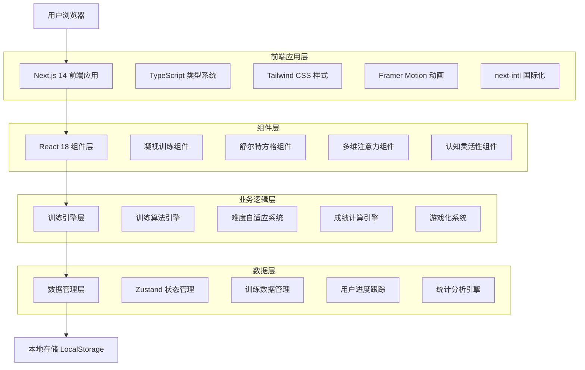

# 四大注意力训练项目技术架构文档

## 1. 架构设计



## 2. 技术描述

**前端技术栈：**

* React\@18 + Next.js\@14 + TypeScript

* Tailwind CSS\@3 + Framer Motion

* Zustand + React Query

* next-intl 国际化

* Radix UI 组件库

**开发工具：**

* Vite 构建工具

* ESLint + Prettier 代码规范

* Jest + Testing Library 测试框架

* Storybook 组件文档

## 3. 路由定义

| 路由                           | 用途                         |
| ---------------------------- | -------------------------- |
| /train/gaze                  | 凝视训练页面，提供静态凝视、动态追踪、抗干扰训练模式 |
| /train/schulte               | 舒尔特方格训练页面，支持多种规格和训练模式      |
| /train/multi-attention       | 多维注意力挑战页面，综合性注意力训练         |
| /train/cognitive-flexibility | 认知灵活性训练营页面，认知切换和适应性训练      |
| /train/settings              | 训练设置页面，个性化参数配置             |
| /train/statistics            | 训练统计页面，数据分析和进度展示           |
| /train/achievements          | 成就页面，游戏化激励系统               |

## 4. 核心组件设计

### 4.1 凝视训练组件 (GazeTraining)

**组件接口：**

```typescript
interface GazeTrainingProps {
  mode: 'static' | 'dynamic' | 'distraction';
  duration: number; // 训练时长（秒）
  difficulty: number; // 难度级别 0-1
  targetSize: number; // 凝视目标大小
  backgroundColor: string; // 背景颜色
  distractionLevel: number; // 干扰程度
  onProgress: (data: GazeProgressData) => void;
  onComplete: (result: GazeTrainingResult) => void;
}

interface GazeProgressData {
  timestamp: number;
  stability: number; // 凝视稳定性 0-1
  focusIntensity: number; // 专注强度 0-1
  blinkCount: number; // 眨眼次数
}

interface GazeTrainingResult {
  mode: string;
  duration: number;
  averageStability: number;
  maxStability: number;
  focusScore: number;
  improvementAreas: string[];
  nextRecommendation: TrainingRecommendation;
}
```

**核心功能实现：**

```typescript
const GazeTraining: React.FC<GazeTrainingProps> = ({
  mode,
  duration,
  difficulty,
  onProgress,
  onComplete
}) => {
  const [isActive, setIsActive] = useState(false);
  const [currentStability, setCurrentStability] = useState(0);
  const [progressData, setProgressData] = useState<GazeProgressData[]>([]);
  
  // 凝视稳定性检测算法
  const detectGazeStability = useCallback(() => {
    // 模拟眼动追踪数据
    const stability = Math.random() * 0.3 + 0.7; // 基础稳定性
    const noise = (Math.random() - 0.5) * difficulty * 0.4; // 难度影响
    const finalStability = Math.max(0, Math.min(1, stability + noise));
    
    setCurrentStability(finalStability);
    
    const progressPoint: GazeProgressData = {
      timestamp: Date.now(),
      stability: finalStability,
      focusIntensity: finalStability * 0.9 + Math.random() * 0.1,
      blinkCount: Math.floor(Math.random() * 3)
    };
    
    setProgressData(prev => [...prev, progressPoint]);
    onProgress(progressPoint);
  }, [difficulty, onProgress]);
  
  // 训练结果计算
  const calculateResult = useCallback((): GazeTrainingResult => {
    const avgStability = progressData.reduce((sum, data) => sum + data.stability, 0) / progressData.length;
    const maxStability = Math.max(...progressData.map(data => data.stability));
    const focusScore = avgStability * 100;
    
    return {
      mode,
      duration,
      averageStability: avgStability,
      maxStability,
      focusScore,
      improvementAreas: generateImprovementAreas(avgStability),
      nextRecommendation: generateNextRecommendation(focusScore)
    };
  }, [progressData, mode, duration]);
  
  return (
    <div className="gaze-training-container">
      {/* 凝视目标渲染 */}
      {/* 实时反馈显示 */}
      {/* 进度指示器 */}
    </div>
  );
};
```

### 4.2 舒尔特方格组件 (SchulteGrid)

**组件接口：**

```typescript
interface SchulteGridProps {
  size: 3 | 5 | 7 | 9; // 方格大小
  mode: 'sequential' | 'reverse' | 'random'; // 训练模式
  timeLimit?: number; // 时间限制（秒）
  showNumbers: boolean; // 是否显示数字
  gridTheme: 'classic' | 'neon' | 'space'; // 主题样式
  onNumberClick: (number: number, isCorrect: boolean, reactionTime: number) => void;
  onComplete: (result: SchulteGridResult) => void;
  onTimeUpdate: (remainingTime: number) => void;
}

interface SchulteGridResult {
  size: number;
  mode: string;
  completionTime: number;
  accuracy: number;
  averageReactionTime: number;
  errorCount: number;
  clickSequence: ClickData[];
  performanceRating: 'excellent' | 'good' | 'average' | 'needs_improvement';
}

interface ClickData {
  number: number;
  timestamp: number;
  reactionTime: number;
  isCorrect: boolean;
  position: { x: number; y: number };
}
```

**核心算法实现：**

```typescript
const SchulteGrid: React.FC<SchulteGridProps> = ({
  size,
  mode,
  timeLimit,
  onNumberClick,
  onComplete
}) => {
  const [grid, setGrid] = useState<number[][]>([]);
  const [currentTarget, setCurrentTarget] = useState(1);
  const [startTime, setStartTime] = useState<number | null>(null);
  const [clickHistory, setClickHistory] = useState<ClickData[]>([]);
  
  // 生成随机方格
  const generateGrid = useCallback(() => {
    const numbers = Array.from({ length: size * size }, (_, i) => i + 1);
    const shuffled = shuffleArray(numbers);
    const newGrid: number[][] = [];
    
    for (let i = 0; i < size; i++) {
      newGrid[i] = shuffled.slice(i * size, (i + 1) * size);
    }
    
    setGrid(newGrid);
  }, [size]);
  
  // 处理数字点击
  const handleNumberClick = useCallback((number: number, position: { x: number; y: number }) => {
    if (!startTime) {
      setStartTime(Date.now());
    }
    
    const now = Date.now();
    const reactionTime = startTime ? now - startTime : 0;
    const isCorrect = number === currentTarget;
    
    const clickData: ClickData = {
      number,
      timestamp: now,
      reactionTime,
      isCorrect,
      position
    };
    
    setClickHistory(prev => [...prev, clickData]);
    onNumberClick(number, isCorrect, reactionTime);
    
    if (isCorrect) {
      if (currentTarget === size * size) {
        // 训练完成
        const result = calculateSchulteResult(clickHistory, startTime, now);
        onComplete(result);
      } else {
        setCurrentTarget(prev => prev + 1);
      }
    }
  }, [currentTarget, startTime, size, clickHistory, onNumberClick, onComplete]);
  
  return (
    <div className="schulte-grid-container">
      {/* 方格渲染 */}
      {/* 计时器显示 */}
      {/* 目标数字提示 */}
    </div>
  );
};
```

### 4.3 多维注意力组件 (MultiAttentionChallenge)

**组件接口：**

```typescript
interface MultiAttentionProps {
  challenges: AttentionChallenge[]; // 注意力挑战任务
  simultaneousTasks: number; // 同时进行的任务数
  adaptiveDifficulty: boolean; // 是否启用自适应难度
  sensoryModalities: ('visual' | 'auditory' | 'tactile')[]; // 感官模态
  onTaskComplete: (taskId: string, result: TaskResult) => void;
  onSessionComplete: (result: MultiAttentionResult) => void;
}

interface AttentionChallenge {
  id: string;
  type: 'visual_search' | 'auditory_discrimination' | 'dual_task' | 'inhibition';
  difficulty: number;
  duration: number;
  parameters: Record<string, any>;
}

interface MultiAttentionResult {
  totalScore: number;
  taskResults: TaskResult[];
  attentionMetrics: {
    selectiveAttention: number;
    dividedAttention: number;
    sustainedAttention: number;
    executiveControl: number;
  };
  cognitiveLoad: number;
  multitaskingEfficiency: number;
}
```

### 4.4 认知灵活性组件 (CognitiveFlexibilityTraining)

**组件接口：**

```typescript
interface CognitiveFlexibilityProps {
  trainingMode: 'task_switching' | 'set_shifting' | 'cognitive_inhibition';
  complexityLevel: number; // 复杂度级别
  ruleChangeFrequency: number; // 规则变化频率
  contextualCues: boolean; // 是否提供上下文线索
  onRuleChange: (newRule: CognitiveRule) => void;
  onResponse: (response: CognitiveResponse) => void;
  onTrainingComplete: (result: CognitiveFlexibilityResult) => void;
}

interface CognitiveRule {
  id: string;
  description: string;
  category: string;
  parameters: Record<string, any>;
  validityDuration: number;
}

interface CognitiveFlexibilityResult {
  switchingCost: number; // 切换成本
  adaptationSpeed: number; // 适应速度
  errorRate: number; // 错误率
  flexibilityIndex: number; // 灵活性指数
  persistenceErrors: number; // 持续性错误
  cognitiveControl: number; // 认知控制能力
}
```

## 5. 状态管理架构

### 5.1 全局状态设计

```typescript
// 训练状态管理
interface TrainingState {
  // 当前训练会话
  currentSession: TrainingSession | null;
  
  // 用户进度数据
  userProgress: {
    gaze: GazeProgress;
    schulte: SchulteProgress;
    multiAttention: MultiAttentionProgress;
    cognitiveFlexibility: CognitiveFlexibilityProgress;
  };
  
  // 训练设置
  settings: {
    difficulty: number;
    duration: number;
    theme: string;
    soundEnabled: boolean;
    vibrationEnabled: boolean;
  };
  
  // 成就和等级
  achievements: Achievement[];
  userLevel: number;
  experience: number;
  
  // 统计数据
  statistics: TrainingStatistics;
}

// Zustand Store 实现
const useTrainingStore = create<TrainingState & TrainingActions>((set, get) => ({
  // 初始状态
  currentSession: null,
  userProgress: {
    gaze: { level: 1, totalSessions: 0, bestScore: 0 },
    schulte: { level: 1, totalSessions: 0, bestTime: Infinity },
    multiAttention: { level: 1, totalSessions: 0, bestScore: 0 },
    cognitiveFlexibility: { level: 1, totalSessions: 0, bestFlexibilityIndex: 0 }
  },
  settings: {
    difficulty: 0.5,
    duration: 300,
    theme: 'space',
    soundEnabled: true,
    vibrationEnabled: false
  },
  achievements: [],
  userLevel: 1,
  experience: 0,
  statistics: {
    totalTrainingTime: 0,
    totalSessions: 0,
    averageScore: 0,
    improvementRate: 0
  },
  
  // Actions
  startTraining: (type, settings) => {
    const session: TrainingSession = {
      id: generateId(),
      type,
      startTime: new Date(),
      settings,
      progress: [],
      status: 'active'
    };
    set({ currentSession: session });
  },
  
  updateProgress: (progress) => {
    const { currentSession } = get();
    if (currentSession) {
      set({
        currentSession: {
          ...currentSession,
          progress: [...currentSession.progress, progress]
        }
      });
    }
  },
  
  completeTraining: (result) => {
    const { currentSession, userProgress } = get();
    if (currentSession) {
      // 更新用户进度
      const updatedProgress = updateUserProgress(userProgress, currentSession.type, result);
      
      // 检查成就解锁
      const newAchievements = checkAchievements(result, updatedProgress);
      
      // 计算经验值
      const expGained = calculateExperience(result);
      
      set({
        currentSession: null,
        userProgress: updatedProgress,
        achievements: [...get().achievements, ...newAchievements],
        experience: get().experience + expGained
      });
      
      // 保存到本地存储
      saveTrainingData({
        session: { ...currentSession, result, endTime: new Date() },
        progress: updatedProgress
      });
    }
  }
}));
```

### 5.2 数据持久化策略

```typescript
class TrainingDataManager {
  private static instance: TrainingDataManager;
  private encryptionKey: string;
  
  constructor() {
    this.encryptionKey = this.generateEncryptionKey();
  }
  
  // 保存训练数据
  async saveTrainingData(data: TrainingData): Promise<void> {
    try {
      const serialized = JSON.stringify(data);
      const encrypted = await this.encrypt(serialized);
      localStorage.setItem('brain-train-data', encrypted);
      
      // 备份到 IndexedDB
      await this.saveToIndexedDB(data);
    } catch (error) {
      console.error('Failed to save training data:', error);
      throw new Error('数据保存失败');
    }
  }
  
  // 加载训练数据
  async loadTrainingData(): Promise<TrainingData | null> {
    try {
      // 优先从 localStorage 加载
      const encrypted = localStorage.getItem('brain-train-data');
      if (encrypted) {
        const decrypted = await this.decrypt(encrypted);
        return JSON.parse(decrypted);
      }
      
      // 备用方案：从 IndexedDB 加载
      return await this.loadFromIndexedDB();
    } catch (error) {
      console.error('Failed to load training data:', error);
      return null;
    }
  }
  
  // 数据加密
  private async encrypt(data: string): Promise<string> {
    const encoder = new TextEncoder();
    const dataBuffer = encoder.encode(data);
    const keyBuffer = encoder.encode(this.encryptionKey);
    
    const cryptoKey = await crypto.subtle.importKey(
      'raw',
      keyBuffer,
      { name: 'AES-GCM' },
      false,
      ['encrypt']
    );
    
    const iv = crypto.getRandomValues(new Uint8Array(12));
    const encrypted = await crypto.subtle.encrypt(
      { name: 'AES-GCM', iv },
      cryptoKey,
      dataBuffer
    );
    
    const combined = new Uint8Array(iv.length + encrypted.byteLength);
    combined.set(iv);
    combined.set(new Uint8Array(encrypted), iv.length);
    
    return btoa(String.fromCharCode(...combined));
  }
  
  // 数据解密
  private async decrypt(encryptedData: string): Promise<string> {
    const combined = new Uint8Array(
      atob(encryptedData).split('').map(char => char.charCodeAt(0))
    );
    
    const iv = combined.slice(0, 12);
    const encrypted = combined.slice(12);
    
    const encoder = new TextEncoder();
    const keyBuffer = encoder.encode(this.encryptionKey);
    
    const cryptoKey = await crypto.subtle.importKey(
      'raw',
      keyBuffer,
      { name: 'AES-GCM' },
      false,
      ['decrypt']
    );
    
    const decrypted = await crypto.subtle.decrypt(
      { name: 'AES-GCM', iv },
      cryptoKey,
      encrypted
    );
    
    const decoder = new TextDecoder();
    return decoder.decode(decrypted);
  }
}
```

## 6. 难度自适应算法

### 6.1 自适应难度引擎

```typescript
class AdaptiveDifficultyEngine {
  private userProfile: UserProfile;
  private performanceHistory: PerformanceRecord[];
  
  constructor(userProfile: UserProfile) {
    this.userProfile = userProfile;
    this.performanceHistory = [];
  }
  
  // 计算下次训练难度
  calculateNextDifficulty(trainingType: TrainingType, currentResult: TrainingResult): number {
    const baseFactors = this.getBaseFactors(trainingType);
    const performanceFactors = this.analyzePerformance(currentResult);
    const trendFactors = this.analyzeTrends(trainingType);
    const userFactors = this.getUserFactors();
    
    const difficultyAdjustment = this.weightedAverage([
      { value: performanceFactors.scoreAdjustment, weight: 0.4 },
      { value: performanceFactors.accuracyAdjustment, weight: 0.3 },
      { value: trendFactors.improvementRate, weight: 0.2 },
      { value: userFactors.experienceLevel, weight: 0.1 }
    ]);
    
    const newDifficulty = Math.max(0.1, Math.min(1.0, 
      baseFactors.currentDifficulty + difficultyAdjustment
    ));
    
    return this.smoothDifficultyTransition(baseFactors.currentDifficulty, newDifficulty);
  }
  
  // 性能分析
  private analyzePerformance(result: TrainingResult): PerformanceFactors {
    const targetAccuracy = 0.75; // 目标准确率
    const targetScore = this.getTargetScore(result.trainingType);
    
    const accuracyDiff = result.accuracy - targetAccuracy;
    const scoreDiff = (result.score - targetScore) / targetScore;
    
    return {
      scoreAdjustment: scoreDiff * 0.2, // 分数差异影响
      accuracyAdjustment: accuracyDiff * 0.3, // 准确率差异影响
      timeAdjustment: this.calculateTimeAdjustment(result),
      consistencyFactor: this.calculateConsistency(result)
    };
  }
  
  // 趋势分析
  private analyzeTrends(trainingType: TrainingType): TrendFactors {
    const recentSessions = this.performanceHistory
      .filter(record => record.trainingType === trainingType)
      .slice(-10); // 最近10次训练
    
    if (recentSessions.length < 3) {
      return { improvementRate: 0, stabilityIndex: 0.5 };
    }
    
    const scores = recentSessions.map(session => session.score);
    const improvementRate = this.calculateImprovementRate(scores);
    const stabilityIndex = this.calculateStabilityIndex(scores);
    
    return { improvementRate, stabilityIndex };
  }
  
  // 平滑难度过渡
  private smoothDifficultyTransition(current: number, target: number): number {
    const maxChange = 0.1; // 单次最大变化量
    const change = target - current;
    
    if (Math.abs(change) <= maxChange) {
      return target;
    }
    
    return current + (change > 0 ? maxChange : -maxChange);
  }
}
```

### 6.2 个性化推荐系统

```typescript
class PersonalizedRecommendationEngine {
  private userProfile: UserProfile;
  private trainingHistory: TrainingSession[];
  private preferenceModel: UserPreferenceModel;
  
  // 生成训练推荐
  generateRecommendations(): TrainingRecommendation[] {
    const recommendations: TrainingRecommendation[] = [];
    
    // 基于能力短板的推荐
    const weakAreas = this.identifyWeakAreas();
    weakAreas.forEach(area => {
      recommendations.push(this.createWeaknessTargetedRecommendation(area));
    });
    
    // 基于用户偏好的推荐
    const preferredTypes = this.getPreferredTrainingTypes();
    preferredTypes.forEach(type => {
      recommendations.push(this.createPreferenceBasedRecommendation(type));
    });
    
    // 基于时间的推荐
    const timeBasedRec = this.createTimeBasedRecommendation();
    if (timeBasedRec) {
      recommendations.push(timeBasedRec);
    }
    
    // 排序和过滤
    return this.rankRecommendations(recommendations).slice(0, 5);
  }
  
  // 识别能力短板
  private identifyWeakAreas(): TrainingType[] {
    const abilities = {
      gaze: this.calculateAbilityScore('gaze'),
      schulte: this.calculateAbilityScore('schulte'),
      multiAttention: this.calculateAbilityScore('multiAttention'),
      cognitiveFlexibility: this.calculateAbilityScore('cognitiveFlexibility')
    };
    
    const averageScore = Object.values(abilities).reduce((sum, score) => sum + score, 0) / 4;
    const threshold = averageScore * 0.8; // 低于平均分80%视为短板
    
    return Object.entries(abilities)
      .filter(([_, score]) => score < threshold)
      .map(([type, _]) => type as TrainingType);
  }
  
  // 创建针对性推荐
  private createWeaknessTargetedRecommendation(weakArea: TrainingType): TrainingRecommendation {
    const currentLevel = this.userProfile.levels[weakArea];
    const recommendedDifficulty = Math.max(0.3, currentLevel * 0.8); // 略低于当前水平
    
    return {
      type: weakArea,
      priority: 'high',
      difficulty: recommendedDifficulty,
      duration: this.getOptimalDuration(weakArea),
      reason: `提升${this.getTrainingTypeName(weakArea)}能力`,
      expectedImprovement: this.calculateExpectedImprovement(weakArea, recommendedDifficulty)
    };
  }
}
```

## 7. 游戏化系统实现

### 7.1 成就系统

```typescript
class AchievementSystem {
  private achievements: Achievement[];
  private userProgress: UserProgress;
  
  // 检查成就解锁
  checkAchievements(trainingResult: TrainingResult, userStats: UserStatistics): Achievement[] {
    const unlockedAchievements: Achievement[] = [];
    
    this.achievements.forEach(achievement => {
      if (!achievement.unlocked && this.isAchievementMet(achievement, trainingResult, userStats)) {
        achievement.unlocked = true;
        achievement.unlockedAt = new Date();
        unlockedAchievements.push(achievement);
        
        // 触发成就解锁动画
        this.triggerAchievementAnimation(achievement);
      }
    });
    
    return unlockedAchievements;
  }
  
  // 判断成就是否达成
  private isAchievementMet(
    achievement: Achievement, 
    result: TrainingResult, 
    stats: UserStatistics
  ): boolean {
    switch (achievement.type) {
      case 'training_streak':
        return stats.currentStreak >= achievement.requirement.days;
        
      case 'score_milestone':
        return result.score >= achievement.requirement.score;
        
      case 'accuracy_master':
        return result.accuracy >= achievement.requirement.accuracy;
        
      case 'speed_demon':
        return result.completionTime <= achievement.requirement.maxTime;
        
      case 'total_sessions':
        return stats.totalSessions >= achievement.requirement.sessions;
        
      case 'improvement_rate':
        return stats.improvementRate >= achievement.requirement.rate;
        
      default:
        return false;
    }
  }
  
  // 成就解锁动画
  private triggerAchievementAnimation(achievement: Achievement): void {
    const event = new CustomEvent('achievementUnlocked', {
      detail: {
        achievement,
        animation: {
          type: 'celebration',
          duration: 3000,
          effects: ['confetti', 'glow', 'bounce']
        }
      }
    });
    
    window.dispatchEvent(event);
  }
}
```

### 7.2 等级系统

```typescript
class LevelSystem {
  private experienceTable: number[];
  
  constructor() {
    // 生成经验值表（指数增长）
    this.experienceTable = this.generateExperienceTable(100);
  }
  
  // 计算用户等级
  calculateLevel(totalExperience: number): LevelInfo {
    let level = 1;
    let experienceForCurrentLevel = 0;
    
    for (let i = 0; i < this.experienceTable.length; i++) {
      if (totalExperience >= this.experienceTable[i]) {
        level = i + 1;
        experienceForCurrentLevel = this.experienceTable[i];
      } else {
        break;
      }
    }
    
    const experienceForNextLevel = this.experienceTable[level] || Infinity;
    const progressToNextLevel = level < this.experienceTable.length 
      ? (totalExperience - experienceForCurrentLevel) / (experienceForNextLevel - experienceForCurrentLevel)
      : 1;
    
    return {
      currentLevel: level,
      totalExperience,
      experienceForCurrentLevel,
      experienceForNextLevel,
      progressToNextLevel,
      title: this.getLevelTitle(level),
      perks: this.getLevelPerks(level)
    };
  }
  
  // 计算训练经验值
  calculateTrainingExperience(result: TrainingResult): number {
    const baseExp = 50;
    const scoreMultiplier = result.score / 100;
    const accuracyBonus = result.accuracy * 30;
    const difficultyBonus = result.difficulty * 20;
    const timeBonus = this.calculateTimeBonus(result.completionTime, result.trainingType);
    
    const totalExp = Math.round(
      baseExp * scoreMultiplier + accuracyBonus + difficultyBonus + timeBonus
    );
    
    return Math.max(10, totalExp); // 最少获得10经验
  }
  
  // 生成经验值表
  private generateExperienceTable(maxLevel: number): number[] {
    const table: number[] = [];
    let totalExp = 0;
    
    for (let level = 1; level <= maxLevel; level++) {
      const expForLevel = Math.floor(100 * Math.pow(1.2, level - 1));
      totalExp += expForLevel;
      table.push(totalExp);
    }
    
    return table;
  }
  
  // 获取等级称号
  private getLevelTitle(level: number): string {
    if (level <= 10) return '新手训练师';
    if (level <= 25) return '进阶学者';
    if (level <= 50) return '专注大师';
    if (level <= 75) return '认知专家';
    return '脑力宗师';
  }
}
```

## 8. 数据分析引擎

### 8.1 统计分析系统

```typescript
class TrainingAnalyticsEngine {
  private trainingHistory: TrainingSession[];
  private userMetrics: UserMetrics;
  
  // 生成综合分析报告
  generateAnalyticsReport(timeRange: TimeRange): AnalyticsReport {
    const filteredSessions = this.filterSessionsByTimeRange(timeRange);
    
    return {
      overview: this.generateOverview(filteredSessions),
      abilityAnalysis: this.analyzeAbilities(filteredSessions),
      progressTrends: this.analyzeProgressTrends(filteredSessions),
      performanceMetrics: this.calculatePerformanceMetrics(filteredSessions),
      recommendations: this.generateRecommendations(filteredSessions),
      comparisons: this.generateComparisons(filteredSessions)
    };
  }
  
  // 能力分析
  private analyzeAbilities(sessions: TrainingSession[]): AbilityAnalysis {
    const abilitiesByType = this.groupSessionsByType(sessions);
    
    return {
      attention: this.analyzeAttentionAbility(abilitiesByType.attention),
      memory: this.analyzeMemoryAbility(abilitiesByType.memory),
      processing: this.analyzeProcessingSpeed(abilitiesByType.processing),
      flexibility: this.analyzeCognitiveFlexibility(abilitiesByType.flexibility),
      overall: this.calculateOverallAbility(abilitiesByType)
    };
  }
  
  // 进步趋势分析
  private analyzeProgressTrends(sessions: TrainingSession[]): ProgressTrends {
    const timeSeriesData = this.createTimeSeriesData(sessions);
    
    return {
      scoreProgression: this.calculateScoreProgression(timeSeriesData),
      accuracyTrend: this.calculateAccuracyTrend(timeSeriesData),
      speedImprovement: this.calculateSpeedImprovement(timeSeriesData),
      consistencyIndex: this.calculateConsistencyIndex(timeSeriesData),
      learningRate: this.calculateLearningRate(timeSeriesData)
    };
  }
  
  // 性能指标计算
  private calculatePerformanceMetrics(sessions: TrainingSession[]): PerformanceMetrics {
    const scores = sessions.map(s => s.result?.score || 0);
    const accuracies = sessions.map(s => s.result?.accuracy || 0);
    const times = sessions.map(s => s.result?.completionTime || 0);
    
    return {
      averageScore: this.calculateMean(scores),
      scoreStandardDeviation: this.calculateStandardDeviation(scores),
      averageAccuracy: this.calculateMean(accuracies),
      averageCompletionTime: this.calculateMean(times),
      improvementRate: this.calculateImprovementRate(scores),
      performanceStability: this.calculatePerformanceStability(scores),
      efficiencyIndex: this.calculateEfficiencyIndex(scores, times)
    };
  }
}
```

### 8.2 可视化数据处理

```typescript
class DataVisualizationEngine {
  // 生成能力雷达图数据
  generateRadarChartData(userStats: UserStatistics): RadarChartData {
    const abilities = {
      '专注力': this.normalizeScore(userStats.attentionScore),
      '记忆力': this.normalizeScore(userStats.memoryScore),
      '处理速度': this.normalizeScore(userStats.processingSpeed),
      '认知灵活性': this.normalizeScore(userStats.cognitiveFlexibility),
      '执行控制': this.normalizeScore(userStats.executiveControl)
    };
    
    return {
      labels: Object.keys(abilities),
      datasets: [{
        label: '当前能力',
        data: Object.values(abilities),
        backgroundColor: 'rgba(54, 162, 235, 0.2)',
        borderColor: 'rgba(54, 162, 235, 1)',
        pointBackgroundColor: 'rgba(54, 162, 235, 1)'
      }]
    };
  }
  
  // 生成进步曲线数据
  generateProgressLineData(sessions: TrainingSession[]): LineChartData {
    const sortedSessions = sessions.sort((a, b) => 
      new Date(a.startTime).getTime() - new Date(b.startTime).getTime()
    );
    
    const labels = sortedSessions.map(session => 
      new Date(session.startTime).toLocaleDateString()
    );
    
    const scoreData = sortedSessions.map(session => session.result?.score || 0);
    const accuracyData = sortedSessions.map(session => 
      (session.result?.accuracy || 0) * 100
    );
    
    return {
      labels,
      datasets: [
        {
          label: '训练分数',
          data: scoreData,
          borderColor: 'rgb(75, 192, 192)',
          backgroundColor: 'rgba(75, 192, 192, 0.2)',
          tension: 0.4
        },
        {
          label: '准确率 (%)',
          data: accuracyData,
          borderColor: 'rgb(255, 99, 132)',
          backgroundColor: 'rgba(255, 99, 132, 0.2)',
          tension: 0.4
        }
      ]
    };
  }
  
  // 生成热力图数据
  generateHeatmapData(sessions: TrainingSession[]): HeatmapData {
    const heatmapMatrix: number[][] = [];
    const hours = Array.from({ length: 24 }, (_, i) => i);
    const days = ['周日', '周一', '周二', '周三', '周四', '周五', '周六'];
    
    // 初始化矩阵
    for (let day = 0; day < 7; day++) {
      heatmapMatrix[day] = new Array(24).fill(0);
    }
    
    // 统计训练时间分布
    sessions.forEach(session => {
      const date = new Date(session.startTime);
      const dayOfWeek = date.getDay();
      const hour = date.getHours();
      heatmapMatrix[dayOfWeek][hour]++;
    });
    
    return {
      xLabels: hours.map(h => `${h}:00`),
      yLabels: days,
      data: heatmapMatrix
    };
  }
}
```

## 9. 国际化实现

### 9.1 翻译文件结构

```typescript
// zh-CN.json
{
  "training": {
    "gaze": {
      "title": "凝视训练",
      "description": "通过专注凝视提升持续注意力",
      "modes": {
        "static": "静态凝视",
        "dynamic": "动态追踪",
        "distraction": "抗干扰训练"
      },
      "instructions": {
        "static": "请专注凝视屏幕中央的目标点，保持注意力集中",
        "dynamic": "请跟随移动的目标点，保持视线追踪",
        "distraction": "在干扰环境中保持对目标的专注"
      },
      "feedback": {
        "excellent": "专注度极佳！继续保持",
        "good": "专注状态良好",
        "average": "注意力有所分散，请重新集中",
        "poor": "需要更加专注，深呼吸后重试"
      },
      "results": {
        "stability": "凝视稳定性",
        "focus_score": "专注分数",
        "improvement_areas": "改进建议",
        "next_recommendation": "下次训练推荐"
      }
    },
    "schulte": {
      "title": "舒尔特方格",
      "description": "提升视觉搜索和注意力分配能力",
      "grid_sizes": {
        "3x3": "3×3 基础",
        "5x5": "5×5 进阶",
        "7x7": "7×7 高级",
        "9x9": "9×9 专家"
      },
      "modes": {
        "sequential": "顺序模式",
        "reverse": "逆序模式",
        "random": "随机模式"
      },
      "instructions": {
        "sequential": "按照从1开始的顺序点击数字",
        "reverse": "按照从最大数字开始的逆序点击",
        "random": "按照系统提示的随机顺序点击"
      },
      "results": {
        "completion_time": "完成时间",
        "accuracy": "准确率",
        "average_reaction": "平均反应时间",
        "error_count": "错误次数",
        "performance_rating": "表现评级"
      }
    },
    "multi_attention": {
      "title": "多维注意力挑战",
      "description": "综合性注意力训练，提升多任务处理能力",
      "challenge_types": {
        "visual_search": "视觉搜索",
        "auditory_discrimination": "听觉辨别",
        "dual_task": "双重任务",
        "inhibition": "抑制控制"
      },
      "sensory_modalities": {
        "visual": "视觉",
        "auditory": "听觉",
        "tactile": "触觉"
      },
      "results": {
        "total_score": "总分",
        "selective_attention": "选择性注意力",
        "divided_attention": "分散注意力",
        "sustained_attention": "持续注意力",
        "executive_control": "执行控制",
        "cognitive_load": "认知负荷",
        "multitasking_efficiency": "多任务效率"
      }
    },
    "cognitive_flexibility": {
      "title": "认知灵活性训练营",
      "description": "提升思维灵活性和适应能力",
      "training_modes": {
        "task_switching": "任务切换",
        "set_shifting": "心理定势转换",
        "cognitive_inhibition": "认知抑制"
      },
      "contexts": {
        "workplace": "职场情境",
        "academic": "学习情境",
        "daily_life": "日常生活"
      },
      "results": {
        "switching_cost": "切换成本",
        "adaptation_speed": "适应速度",
        "error_rate": "错误率",
        "flexibility_index": "灵活性指数",
        "persistence_errors": "持续性错误",
        "cognitive_control": "认知控制"
      }
    },
    "common": {
      "start_training": "开始训练",
      "pause_training": "暂停训练",
      "resume_training": "继续训练",
      "stop_training": "停止训练",
      "restart_training": "重新开始",
      "settings": "设置",
      "statistics": "统计",
      "achievements": "成就",
      "difficulty": "难度",
      "duration": "时长",
      "score": "分数",
      "accuracy": "准确率",
      "time": "时间",
      "level": "等级",
      "experience": "经验值",
      "progress": "进度"
    }
  },
  "achievements": {
    "categories": {
      "training_milestones": "训练里程碑",
      "skill_mastery": "技能精通",
      "consistency": "坚持不懈",
      "exploration": "探索精神",
      "social": "社交互动"
    },
    "rarities": {
      "bronze": "青铜",
      "silver": "白银",
      "gold": "黄金",
      "diamond": "钻石",
      "legendary": "传奇"
    }
  },
  "statistics": {
    "overview": {
      "total_training_time": "总训练时长",
      "total_sessions": "总训练次数",
      "average_score": "平均分数",
      "current_streak": "当前连击",
      "best_streak": "最佳连击",
      "improvement_rate": "提升速度"
    },
    "abilities": {
      "attention": "注意力",
      "memory": "记忆力",
      "processing_speed": "处理速度",
      "cognitive_flexibility": "认知灵活性",
      "executive_control": "执行控制"
    },
    "charts": {
      "progress_trend": "进步趋势",
      "ability_radar": "能力雷达图",
      "training_heatmap": "训练热力图",
      "performance_comparison": "表现对比"
    }
  }
}
```

### 9.2 国际化Hook实现

```typescript
// useTrainingTranslations.ts
import { useTranslations } from 'next-intl';

export const useTrainingTranslations = () => {
  const t = useTranslations('training');
  
  return {
    // 凝视训练翻译
    gaze: {
      title: t('gaze.title'),
      description: t('gaze.description'),
      modes: {
        static: t('gaze.modes.static'),
        dynamic: t('gaze.modes.dynamic'),
        distraction: t('gaze.modes.distraction')
      },
      instructions: {
        static: t('gaze.instructions.static'),
        dynamic: t('gaze.instructions.dynamic'),
        distraction: t('gaze.instructions.distraction')
      },
      feedback: {
        excellent: t('gaze.feedback.excellent'),
        good: t('gaze.feedback.good'),
        average: t('gaze.feedback.average'),
        poor: t('gaze.feedback.poor')
      }
    },
    
    // 舒尔特方格翻译
    schulte: {
      title: t('schulte.title'),
      description: t('schulte.description'),
      gridSizes: {
        '3x3': t('schulte.grid_sizes.3x3'),
        '5x5': t('schulte.grid_sizes.5x5'),
        '7x7': t('schulte.grid_sizes.7x7'),
        '9x9': t('schulte.grid_sizes.9x9')
      },
      modes: {
        sequential: t('schulte.modes.sequential'),
        reverse: t('schulte.modes.reverse'),
        random: t('schulte.modes.random')
      }
    },
    
    // 通用翻译
    common: {
      startTraining: t('common.start_training'),
      pauseTraining: t('common.pause_training'),
      resumeTraining: t('common.resume_training'),
      stopTraining: t('common.stop_training'),
      restartTraining: t('common.restart_training'),
      settings: t('common.settings'),
      statistics: t('common.statistics'),
      achievements: t('common.achievements'),
      difficulty: t('common.difficulty'),
      duration: t('common.duration'),
      score: t('common.score'),
      accuracy: t('common.accuracy'),
      time: t('common.time'),
      level: t('common.level'),
      experience: t('common.experience'),
      progress: t('common.progress')
    }
  };
};

// 格式化数字和时间的Hook
export const useTrainingFormatters = () => {
  const locale = useLocale();
  
  const formatScore = (score: number): string => {
    return new Intl.NumberFormat(locale, {
      minimumFractionDigits: 0,
      maximumFractionDigits: 1
    }).format(score);
  };
  
  const formatTime = (seconds: number): string => {
    const minutes = Math.floor(seconds / 60);
    const remainingSeconds = seconds % 60;
    
    if (locale === 'zh-CN') {
      return `${minutes}分${remainingSeconds}秒`;
    } else {
      return `${minutes}m ${remainingSeconds}s`;
    }
  };
  
  const formatPercentage = (value: number): string => {
    return new Intl.NumberFormat(locale, {
      style: 'percent',
      minimumFractionDigits: 1,
      maximumFractionDigits: 1
    }).format(value);
  };
  
  return {
    formatScore,
    formatTime,
    formatPercentage
  };
};
```

## 10. 性能优化策略

### 10.1 组件优化

```typescript
// 使用React.memo优化组件渲染
const GazeTraining = React.memo<GazeTrainingProps>(({ 
  mode, 
  difficulty, 
  onProgress, 
  onComplete 
}) => {
  // 使用useMemo缓存计算结果
  const trainingConfig = useMemo(() => {
    return calculateTrainingConfig(mode, difficulty);
  }, [mode, difficulty]);
  
  // 使用useCallback缓存事件处理函数
  const handleProgress = useCallback((data: GazeProgressData) => {
    onProgress(data);
  }, [onProgress]);
  
  // 使用useRef避免不必要的重渲染
  const animationRef = useRef<number>();
  const canvasRef = useRef<HTMLCanvasElement>(null);
  
  return (
    <div className="gaze-training">
      <canvas ref={canvasRef} />
      {/* 其他组件 */}
    </div>
  );
});

// 虚拟化长列表
const TrainingHistory = () => {
  const { sessions } = useTrainingStore();
  
  return (
    <FixedSizeList
      height={400}
      itemCount={sessions.length}
      itemSize={80}
      itemData={sessions}
    >
      {({ index, style, data }) => (
        <div style={style}>
          <TrainingSessionItem session={data[index]} />
        </div>
      )}
    </FixedSizeList>
  );
};
```

### 10.2 资源优化

```typescript
// 图片预加载
class ImagePreloader {
  private cache = new Map<string, HTMLImageElement>();
  
  async preloadImages(urls: string[]): Promise<void> {
    const promises = urls.map(url => this.preloadImage(url));
    await Promise.all(promises);
  }
  
  private preloadImage(url: string): Promise<HTMLImageElement> {
    return new Promise((resolve, reject) => {
      if (this.cache.has(url)) {
        resolve(this.cache.get(url)!);
        return;
      }
      
      const img = new Image();
      img.onload = () => {
        this.cache.set(url, img);
        resolve(img);
      };
      img.onerror = reject;
      img.src = url;
    });
  }
}

// 音频资源管理
class AudioManager {
  private audioCache = new Map<string, HTMLAudioElement>();
  private audioContext: AudioContext;
  
  constructor() {
    this.audioContext = new (window.AudioContext || window.webkitAudioContext)();
  }
  
  async loadAudio(url: string): Promise<HTMLAudioElement> {
    if (this.audioCache.has(url)) {
      return this.audioCache.get(url)!;
    }
    
    const audio = new Audio(url);
    audio.preload = 'auto';
    
    return new Promise((resolve, reject) => {
      audio.addEventListener('canplaythrough', () => {
        this.audioCache.set(url, audio);
        resolve(audio);
      });
      audio.addEventListener('error', reject);
    });
  }
  
  playSound(url: string, volume = 1): void {
    const audio = this.audioCache.get(url);
    if (audio) {
      audio.volume = volume;
      audio.currentTime = 0;
      audio.play().catch(console.error);
    }
  }
}
```

## 11. 错误处理与监控

### 11.1 错误边界

```typescript
class TrainingErrorBoundary extends React.Component<
  { children: React.ReactNode },
  { hasError: boolean; error?: Error }
> {
  constructor(props: { children: React.ReactNode }) {
    super(props);
    this.state = { hasError: false };
  }
  
  static getDerivedStateFromError(error: Error) {
    return { hasError: true, error };
  }
  
  componentDidCatch(error: Error, errorInfo: React.ErrorInfo) {
    // 记录错误到监控系统
    this.logError(error, errorInfo);
  }
  
  private logError(error: Error, errorInfo: React.ErrorInfo) {
    const errorData = {
      message: error.message,
      stack: error.stack,
      componentStack: errorInfo.componentStack,
      timestamp: new Date().toISOString(),
      userAgent: navigator.userAgent,
      url: window.location.href
    };
    
    // 发送到错误监控服务
    console.error('Training Error:', errorData);
  }
  
  render() {
    if (this.state.hasError) {
      return (
        <div className="error-fallback">
          <h2>训练出现了问题</h2>
          <p>我们已经记录了这个错误，请刷新页面重试。</p>
          <button onClick={() => window.location.reload()}>
            刷新页面
          </button>
        </div>
      );
    }
    
    return this.props.children;
  }
}
```

### 11.2 性能监控

```typescript
class PerformanceMonitor {
  private metrics: PerformanceMetric[] = [];
  
  // 监控组件渲染性能
  measureRender(componentName: string, renderFn: () => void): void {
    const startTime = performance.now();
    renderFn();
    const endTime = performance.now();
    
    this.recordMetric({
      type: 'render',
      component: componentName,
      duration: endTime - startTime,
      timestamp: Date.now()
    });
  }
  
  // 监控训练性能
  measureTraining(trainingType: string, trainingFn: () => Promise<void>): Promise<void> {
    const startTime = performance.now();
    
    return trainingFn().finally(() => {
      const endTime = performance.now();
      
      this.recordMetric({
        type: 'training',
        component: trainingType,
        duration: endTime - startTime,
        timestamp: Date.now()
      });
    });
  }
  
  // 记录性能指标
  private recordMetric(metric: PerformanceMetric): void {
    this.metrics.push(metric);
    
    // 定期清理旧数据
    if (this.metrics.length > 1000) {
      this.metrics = this.metrics.slice(-500);
    }
    
    // 检查性能阈值
    if (metric.duration > 100) {
      console.warn(`Performance warning: ${metric.component} took ${metric.duration}ms`);
    }
  }
  
  // 获取性能报告
  getPerformanceReport(): PerformanceReport {
    const renderMetrics = this.metrics.filter(m => m.type === 'render');
    const trainingMetrics = this.metrics.filter(m => m.type === 'training');
    
    return {
      averageRenderTime: this.calculateAverage(renderMetrics.map(m => m.duration)),
      averageTrainingTime: this.calculateAverage(trainingMetrics.map(m => m.duration)),
      slowestComponents: this.findSlowestComponents(),
      totalMetrics: this.metrics.length
    };
  }
}
```

## 12. 部署配置

### 12.1 构建配置

```typescript
// next.config.js
const withNextIntl = require('next-intl/plugin')('./src/i18n.ts');

module.exports = withNextIntl({
  experimental: {
    appDir: true,
  },
  images: {
    domains: ['localhost'],
    formats: ['image/webp', 'image/avif'],
  },
  webpack: (config, { dev, isServer }) => {
    // 生产环境优化
    if (!dev && !isServer) {
      config.optimization.splitChunks = {
        chunks: 'all',
        cacheGroups: {
          training: {
            name: 'training',
            test: /[\/]src[\/]components[\/]training[\/]/,
            priority: 10,
          },
          vendor: {
            name: 'vendor',
            test: /[\/]node_modules[\/]/,
            priority: 5,
          },
        },
      };
    }
    
    return config;
  },
  env: {
    NEXT_PUBLIC_APP_VERSION: process.env.npm_package_version,
  },
});
```

### 12.2 环境配置

```bash
# .env.local
NEXT_PUBLIC_APP_NAME=脑力训练平台
NEXT_PUBLIC_DEFAULT_LOCALE=zh-CN
NEXT_PUBLIC_SUPPORTED_LOCALES=zh-CN,en-US
NEXT_PUBLIC_ANALYTICS_ENABLED=true
NEXT_PUBLIC_ERROR_REPORTING_ENABLED=true
```

## 13. 测试策略

### 13.1 单元测试

```typescript
// __tests__/components/GazeTraining.test.tsx
import { render, screen, fireEvent, waitFor } from '@testing-library/react';
import { GazeTraining } from '@/components/training/GazeTraining';

describe('GazeTraining', () => {
  const mockProps = {
    mode: 'static' as const,
    duration: 60,
    difficulty: 0.5,
    targetSize: 20,
    backgroundColor: '#000000',
    distractionLevel: 0.3,
    onProgress: jest.fn(),
    onComplete: jest.fn(),
  };
  
  beforeEach(() => {
    jest.clearAllMocks();
  });
  
  it('应该正确渲染凝视训练组件', () => {
    render(<GazeTraining {...mockProps} />);
    
    expect(screen.getByText('凝视训练')).toBeInTheDocument();
    expect(screen.getByRole('button', { name: '开始训练' })).toBeInTheDocument();
  });
  
  it('应该在点击开始按钮后启动训练', async () => {
    render(<GazeTraining {...mockProps} />);
    
    const startButton = screen.getByRole('button', { name: '开始训练' });
    fireEvent.click(startButton);
    
    await waitFor(() => {
      expect(screen.getByText('训练进行中')).toBeInTheDocument();
    });
  });
  
  it('应该在训练完成后调用onComplete回调', async () => {
    const shortDurationProps = { ...mockProps, duration: 1 };
    render(<GazeTraining {...shortDurationProps} />);
    
    const startButton = screen.getByRole('button', { name: '开始训练' });
    fireEvent.click(startButton);
    
    await waitFor(() => {
      expect(mockProps.onComplete).toHaveBeenCalled();
    }, { timeout: 2000 });
  });
});
```

## 14. 安全考虑

### 14.1 数据安全

```typescript
class SecurityManager {
  // 数据脱敏
  static sanitizeUserData(data: any): any {
    const sensitiveFields = ['email', 'phone', 'address'];
    const sanitized = { ...data };
    
    sensitiveFields.forEach(field => {
      if (sanitized[field]) {
        sanitized[field] = this.maskSensitiveData(sanitized[field]);
      }
    });
    
    return sanitized;
  }
  
  // 输入验证
  static validateTrainingInput(input: TrainingInput): ValidationResult {
    const errors: string[] = [];
    
    if (input.difficulty < 0 || input.difficulty > 1) {
      errors.push('难度值必须在0-1之间');
    }
    
    if (input.duration < 10 || input.duration > 3600) {
      errors.push('训练时长必须在10秒-1小时之间');
    }
    
    return {
      isValid: errors.length === 0,
      errors
    };
  }
  
  // XSS防护
  static sanitizeHTML(html: string): string {
    const div = document.createElement('div');
    div.textContent = html;
    return div.innerHTML;
  }
}
```

## 15. 总结

本技术架构文档详细规划了四大注意力训练项目的技术实现方案，包括：

1. **前端架构**：基于Next.js 14 + React 18 + TypeScript的现代化前端技术栈
2. **组件设计**：模块化、可复用的训练组件，支持多种训练模式和难度级别
3. **状态管理**：使用Zustand进行全局状态管理，支持数据持久化
4. **国际化支持**：基于next-intl的完整国际化方案，避免硬编码
5. **性能优化**：组件优化、资源管理、虚拟化等多层面性能优化
6. **游戏化系统**：完整的成就、等级、经验值系统
7. **数据分析**：强大的统计分析和可视化功能
8. **自适应算法**：智能难度调整和个性化推荐
9. **错误处理**：完善的错误边界和监控机制
10. **安全保障**：数据安全、输入验证、XSS防护

该架构确保了产品的易用性、好用性，同时提供了良好的扩展性和维护性，为用户提供科学、有效、有趣的注意力训练体验。
```

