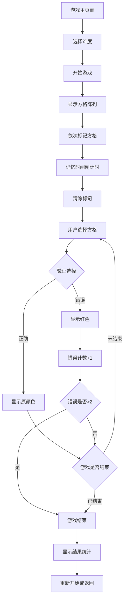

# 方格记忆游戏产品需求文档

## 1. 产品概述

方格记忆是一款专注于提升视觉记忆和空间记忆能力的训练游戏。用户需要在n×n的方格阵列中记住随机标记的方格位置和颜色，然后在标记消失后准确选择出这些方格。游戏通过不同难度级别和颜色反馈机制，帮助用户逐步提升记忆力和专注力。

## 2. 核心功能

### 2.1 用户角色
本游戏面向所有希望提升记忆力的用户，无需特殊角色区分。

### 2.2 功能模块

我们的方格记忆游戏包含以下主要页面：
1. **游戏主页面**：难度选择、游戏说明、开始游戏按钮
2. **游戏训练页面**：方格阵列、标记显示、用户选择、结果反馈
3. **结果统计页面**：成绩显示、进度记录、重新开始选项

### 2.3 页面详情

| 页面名称 | 模块名称 | 功能描述 |
|----------|----------|----------|
| 游戏主页面 | 难度选择器 | 提供简单(3×3)、中等(4×4)、困难(5×5)、专家(6×6)四个难度级别选择 |
| 游戏主页面 | 游戏说明 | 显示游戏规则、操作方法和评分标准 |
| 游戏主页面 | 开始按钮 | 根据选择的难度启动游戏训练 |
| 游戏训练页面 | 方格阵列 | 显示n×n的方格网格，支持点击交互 |
| 游戏训练页面 | 标记系统 | 随机选择n个方格，依次用不同颜色标记，标记完成后给予记忆时间 |
| 游戏训练页面 | 倒计时器 | 显示记忆时间倒计时和游戏进度 |
| 游戏训练页面 | 选择验证 | 用户点击方格进行选择，正确显示原标记颜色，错误显示红色 |
| 游戏训练页面 | 错误计数 | 实时显示错误次数，超过2次自动结束游戏 |
| 结果统计页面 | 成绩显示 | 显示本次游戏的正确率、用时、错误次数等统计信息 |
| 结果统计页面 | 历史记录 | 显示历史最佳成绩和进步趋势 |
| 结果统计页面 | 操作按钮 | 提供重新开始、更换难度、返回菜单等选项 |

## 3. 核心流程

### 3.1 游戏主流程

1. 用户进入方格记忆游戏页面
2. 选择游戏难度（简单/中等/困难/专家）
3. 阅读游戏说明，点击开始游戏
4. 系统生成n×n方格阵列
5. 系统随机选择n个方格，依次用不同颜色标记（每个标记间隔0.5秒）
6. 标记完成后，给用户记忆时间（根据难度2-5秒）
7. 清除所有标记颜色，方格恢复原色
8. 用户开始选择刚才标记的方格
9. 系统实时验证选择：正确显示原标记颜色，错误显示红色
10. 游戏结束条件：错误超过2次 或 全部选择正确
11. 显示游戏结果和统计信息
12. 用户可选择重新开始或返回菜单

## 4. 用户界面设计

### 4.1 设计风格

- **主色调**：薄荷绿(#00D4AA)、紫色(#8B5CF6)、粉色(#EC4899)、蓝色(#3B82F6)
- **按钮风格**：圆角矩形，带有渐变色和悬停动画效果
- **字体**：使用系统默认字体，确保多语言兼容性
- **布局风格**：卡片式布局，居中对齐，响应式设计
- **图标风格**：简洁的线性图标，配合柔和的颜色

### 4.2 页面设计概览

| 页面名称 | 模块名称 | UI元素 |
|----------|----------|--------|
| 游戏主页面 | 难度选择器 | 四个彩色卡片按钮，每个显示难度名称、方格数量、记忆时间等信息 |
| 游戏主页面 | 游戏说明 | 折叠式说明面板，包含图文并茂的操作指南 |
| 游戏训练页面 | 方格阵列 | 等间距的正方形网格，默认为深灰色，标记时显示鲜艳颜色 |
| 游戏训练页面 | 标记动画 | 方格标记时有缩放和发光效果，颜色渐变过渡 |
| 游戏训练页面 | 倒计时器 | 圆形进度条样式，颜色从绿色渐变到红色 |
| 游戏训练页面 | 状态面板 | 显示当前进度、错误次数、剩余选择数等信息 |
| 结果统计页面 | 成绩卡片 | 大号数字显示主要成绩，配合图标和颜色编码 |
| 结果统计页面 | 进度图表 | 简单的折线图显示历史成绩趋势 |

### 4.3 响应式设计

- **桌面端优先**：针对桌面浏览器优化，方格大小适中便于点击
- **移动端适配**：方格尺寸自动调整，确保触摸操作的准确性
- **触摸优化**：增加触摸反馈效果，防止误触

## 5. 难度设计

### 5.1 难度级别配置

| 难度级别 | 方格尺寸 | 标记数量 | 记忆时间 | 目标用户 |
|----------|----------|----------|----------|----------|
| 简单 | 3×3 | 3个 | 5秒 | 初学者、儿童 |
| 中等 | 4×4 | 4个 | 4秒 | 一般用户 |
| 困难 | 5×5 | 5个 | 3秒 | 有经验用户 |
| 专家 | 6×6 | 6个 | 2秒 | 高级用户 |

### 5.2 颜色方案

使用8种不同的鲜艳颜色进行标记：
- 红色(#EF4444)
- 橙色(#F97316)
- 黄色(#EAB308)
- 绿色(#22C55E)
- 青色(#06B6D4)
- 蓝色(#3B82F6)
- 紫色(#8B5CF6)
- 粉色(#EC4899)

### 5.3 评分机制

- **基础分数**：根据难度级别设定基础分(简单100分，中等200分，困难300分，专家400分)
- **时间奖励**：剩余记忆时间越多，奖励分数越高
- **准确率奖励**：全部正确额外获得50%奖励分数
- **连击奖励**：连续多次全部正确有额外奖励

## 6. 技术实现要点

### 6.1 核心算法

- **随机选择算法**：确保每次游戏的方格选择完全随机且不重复
- **颜色分配算法**：为选中的方格分配不同颜色，避免相邻方格颜色过于相似
- **动画时序控制**：精确控制标记显示、记忆时间、用户选择等各阶段的时间

### 6.2 性能优化

- **组件懒加载**：游戏组件按需加载，减少初始加载时间
- **动画优化**：使用CSS3硬件加速，确保动画流畅
- **内存管理**：及时清理游戏状态，避免内存泄漏

### 6.3 数据持久化

- **本地存储**：使用localStorage保存用户设置和历史成绩
- **状态管理**：集成到现有的training-store中
- **数据同步**：支持跨设备的进度同步（未来功能）

## 7. 国际化支持

### 7.1 多语言文本

需要翻译的文本内容包括：
- 游戏标题和描述
- 难度级别名称
- 游戏说明和提示
- 按钮文本
- 结果页面的统计标签
- 错误和成功提示信息

### 7.2 语言支持

- **中文**：简体中文，作为主要语言
- **英文**：国际通用语言
- **日文**：考虑到游戏的动漫风格设计
- **韩语**：扩大亚洲市场覆盖

### 7.3 本地化考虑

- **颜色文化**：确保选用的颜色在不同文化中都有积极含义
- **数字格式**：根据地区习惯显示时间和分数格式
- **字体适配**：确保各语言字体显示正常