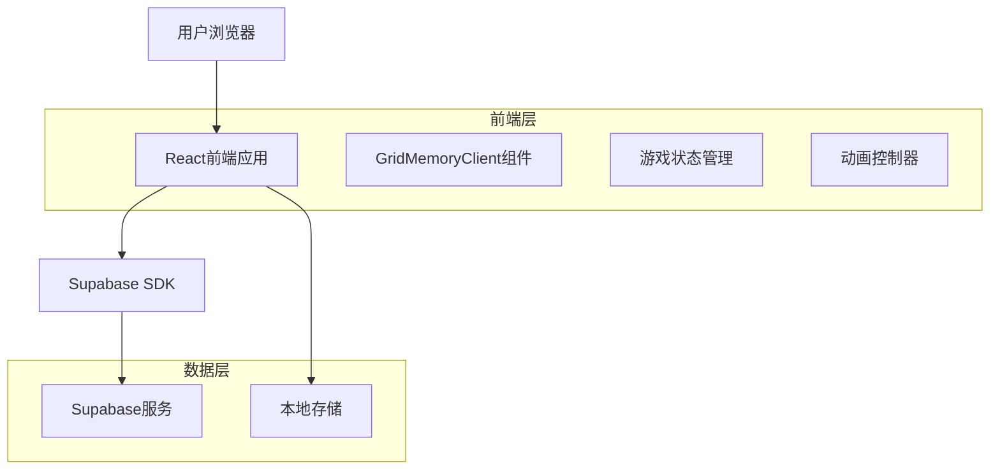
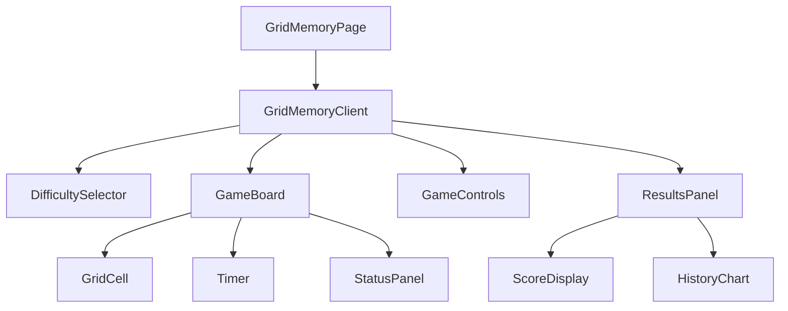
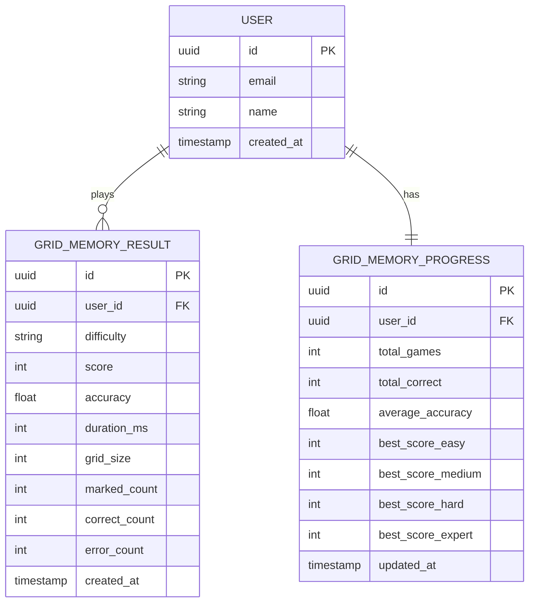

# 方格记忆游戏技术架构文档

## 1. 架构设计



## 2. 技术描述

- **前端**: React@18 + TypeScript + Tailwind CSS + Next.js@14
- **状态管理**: Zustand + 本地持久化
- **动画**: CSS3 Transitions + React动画库
- **国际化**: next-intl
- **后端**: Supabase (认证和数据存储)

## 3. 路由定义

| 路由 | 用途 |
|------|------|
| /memory | 记忆力训练主页，显示所有记忆力游戏列表 |
| /train/grid-memory | 方格记忆游戏页面，包含游戏逻辑和界面 |

## 4. 组件架构

### 4.1 核心组件结构



### 4.2 组件详细设计

#### GridMemoryClient (主游戏组件)
```typescript
interface GridMemoryClientProps {
  locale: string;
}

interface GameState {
  phase: 'setup' | 'marking' | 'memorizing' | 'selecting' | 'result';
  difficulty: 'easy' | 'medium' | 'hard' | 'expert';
  gridSize: number;
  markedCells: MarkedCell[];
  selectedCells: number[];
  errors: number;
  score: number;
  timeRemaining: number;
}

interface MarkedCell {
  index: number;
  color: string;
  order: number;
}
```

#### DifficultySelector (难度选择器)
```typescript
interface DifficultyConfig {
  level: 'easy' | 'medium' | 'hard' | 'expert';
  gridSize: number;
  markCount: number;
  memoryTime: number;
  baseScore: number;
}

const DIFFICULTY_CONFIGS: DifficultyConfig[] = [
  { level: 'easy', gridSize: 3, markCount: 3, memoryTime: 5000, baseScore: 100 },
  { level: 'medium', gridSize: 4, markCount: 4, memoryTime: 4000, baseScore: 200 },
  { level: 'hard', gridSize: 5, markCount: 5, memoryTime: 3000, baseScore: 300 },
  { level: 'expert', gridSize: 6, markCount: 6, memoryTime: 2000, baseScore: 400 }
];
```

#### GameBoard (游戏面板)
```typescript
interface GameBoardProps {
  gridSize: number;
  markedCells: MarkedCell[];
  selectedCells: number[];
  phase: GamePhase;
  onCellClick: (index: number) => void;
}
```

#### GridCell (方格单元)
```typescript
interface GridCellProps {
  index: number;
  isMarked: boolean;
  isSelected: boolean;
  isCorrect?: boolean;
  color?: string;
  phase: GamePhase;
  onClick: () => void;
}
```

## 5. 游戏逻辑实现

### 5.1 核心算法

#### 随机方格选择算法
```typescript
/**
 * 随机选择不重复的方格索引
 * @param gridSize 方格尺寸 (n×n)
 * @param count 选择数量
 * @returns 选中的方格索引数组
 */
function selectRandomCells(gridSize: number, count: number): number[] {
  const totalCells = gridSize * gridSize;
  const availableIndices = Array.from({ length: totalCells }, (_, i) => i);
  const selected: number[] = [];
  
  for (let i = 0; i < count; i++) {
    const randomIndex = Math.floor(Math.random() * availableIndices.length);
    selected.push(availableIndices[randomIndex]);
    availableIndices.splice(randomIndex, 1);
  }
  
  return selected;
}
```

#### 颜色分配算法
```typescript
const GAME_COLORS = [
  '#EF4444', // 红色
  '#F97316', // 橙色
  '#EAB308', // 黄色
  '#22C55E', // 绿色
  '#06B6D4', // 青色
  '#3B82F6', // 蓝色
  '#8B5CF6', // 紫色
  '#EC4899'  // 粉色
];

/**
 * 为选中的方格分配颜色
 * @param selectedIndices 选中的方格索引
 * @returns 带颜色信息的标记方格数组
 */
function assignColors(selectedIndices: number[]): MarkedCell[] {
  return selectedIndices.map((index, order) => ({
    index,
    color: GAME_COLORS[order % GAME_COLORS.length],
    order
  }));
}
```

#### 评分算法
```typescript
/**
 * 计算游戏得分
 * @param config 难度配置
 * @param correctCount 正确选择数量
 * @param totalCount 总标记数量
 * @param timeBonus 时间奖励
 * @returns 最终得分
 */
function calculateScore(
  config: DifficultyConfig,
  correctCount: number,
  totalCount: number,
  timeBonus: number
): number {
  const accuracy = correctCount / totalCount;
  const baseScore = config.baseScore * accuracy;
  const perfectBonus = accuracy === 1 ? config.baseScore * 0.5 : 0;
  
  return Math.round(baseScore + timeBonus + perfectBonus);
}
```

### 5.2 游戏状态管理

```typescript
// 使用Zustand进行状态管理
interface GridMemoryStore {
  // 游戏状态
  currentGame: GameState | null;
  
  // 用户进度
  userProgress: {
    bestScores: Record<string, number>;
    totalGames: number;
    totalCorrect: number;
    averageAccuracy: number;
  };
  
  // 游戏历史
  gameHistory: GameResult[];
  
  // 操作方法
  startGame: (difficulty: DifficultyConfig) => void;
  markCell: (index: number) => void;
  selectCell: (index: number) => void;
  endGame: () => void;
  resetGame: () => void;
}

interface GameResult {
  id: string;
  difficulty: string;
  score: number;
  accuracy: number;
  duration: number;
  timestamp: number;
}
```

## 6. 数据模型

### 6.1 数据模型定义



### 6.2 数据定义语言

#### 游戏结果表 (grid_memory_results)
```sql
-- 创建表
CREATE TABLE grid_memory_results (
  id UUID PRIMARY KEY DEFAULT gen_random_uuid(),
  user_id UUID REFERENCES auth.users(id),
  difficulty VARCHAR(20) NOT NULL CHECK (difficulty IN ('easy', 'medium', 'hard', 'expert')),
  score INTEGER NOT NULL DEFAULT 0,
  accuracy DECIMAL(5,4) NOT NULL DEFAULT 0,
  duration_ms INTEGER NOT NULL,
  grid_size INTEGER NOT NULL,
  marked_count INTEGER NOT NULL,
  correct_count INTEGER NOT NULL,
  error_count INTEGER NOT NULL,
  created_at TIMESTAMP WITH TIME ZONE DEFAULT NOW()
);

-- 创建索引
CREATE INDEX idx_grid_memory_results_user_id ON grid_memory_results(user_id);
CREATE INDEX idx_grid_memory_results_difficulty ON grid_memory_results(difficulty);
CREATE INDEX idx_grid_memory_results_created_at ON grid_memory_results(created_at DESC);
CREATE INDEX idx_grid_memory_results_score ON grid_memory_results(score DESC);

-- 权限设置
GRANT SELECT ON grid_memory_results TO anon;
GRANT ALL PRIVILEGES ON grid_memory_results TO authenticated;
```

#### 用户进度表 (grid_memory_progress)
```sql
-- 创建表
CREATE TABLE grid_memory_progress (
  id UUID PRIMARY KEY DEFAULT gen_random_uuid(),
  user_id UUID UNIQUE REFERENCES auth.users(id),
  total_games INTEGER DEFAULT 0,
  total_correct INTEGER DEFAULT 0,
  average_accuracy DECIMAL(5,4) DEFAULT 0,
  best_score_easy INTEGER DEFAULT 0,
  best_score_medium INTEGER DEFAULT 0,
  best_score_hard INTEGER DEFAULT 0,
  best_score_expert INTEGER DEFAULT 0,
  updated_at TIMESTAMP WITH TIME ZONE DEFAULT NOW()
);

-- 创建索引
CREATE INDEX idx_grid_memory_progress_user_id ON grid_memory_progress(user_id);

-- 权限设置
GRANT SELECT ON grid_memory_progress TO anon;
GRANT ALL PRIVILEGES ON grid_memory_progress TO authenticated;

-- 初始化数据触发器
CREATE OR REPLACE FUNCTION create_grid_memory_progress()
RETURNS TRIGGER AS $$
BEGIN
  INSERT INTO grid_memory_progress (user_id)
  VALUES (NEW.id)
  ON CONFLICT (user_id) DO NOTHING;
  RETURN NEW;
END;
$$ LANGUAGE plpgsql;

CREATE TRIGGER on_auth_user_created_grid_memory
  AFTER INSERT ON auth.users
  FOR EACH ROW EXECUTE FUNCTION create_grid_memory_progress();
```

## 7. 国际化实现

### 7.1 国际化键值定义

```typescript
// 中文 (zh.json)
{
  "gridMemory": {
    "title": "方格记忆",
    "description": "训练视觉记忆和空间记忆能力的益智游戏",
    "difficulties": {
      "easy": "简单",
      "medium": "中等",
      "hard": "困难",
      "expert": "专家"
    },
    "gamePhases": {
      "setup": "准备开始",
      "marking": "标记方格",
      "memorizing": "记忆时间",
      "selecting": "选择方格",
      "result": "游戏结果"
    },
    "controls": {
      "start": "开始游戏",
      "restart": "重新开始",
      "backToMenu": "返回菜单",
      "changeDifficulty": "更换难度"
    },
    "stats": {
      "score": "得分",
      "accuracy": "准确率",
      "timeUsed": "用时",
      "errors": "错误次数",
      "bestScore": "最佳得分",
      "totalGames": "总游戏数"
    },
    "messages": {
      "gameOver": "游戏结束",
      "perfect": "完美！",
      "goodJob": "做得不错！",
      "tryAgain": "再试一次",
      "memorizeNow": "请记住标记的方格",
      "selectMarked": "请选择刚才标记的方格",
      "tooManyErrors": "错误次数过多，游戏结束"
    }
  }
}

// 英文 (en.json)
{
  "gridMemory": {
    "title": "Grid Memory",
    "description": "Train your visual and spatial memory with this puzzle game",
    "difficulties": {
      "easy": "Easy",
      "medium": "Medium",
      "hard": "Hard",
      "expert": "Expert"
    },
    // ... 其他翻译
  }
}

// 日文 (ja.json)
{
  "gridMemory": {
    "title": "グリッドメモリー",
    "description": "視覚記憶と空間記憶を鍛えるパズルゲーム",
    "difficulties": {
      "easy": "簡単",
      "medium": "普通",
      "hard": "難しい",
      "expert": "エキスパート"
    },
    // ... 其他翻译
  }
}

// 韩文 (ko.json)
{
  "gridMemory": {
    "title": "격자 기억",
    "description": "시각 기억과 공간 기억을 훈련하는 퍼즐 게임",
    "difficulties": {
      "easy": "쉬움",
      "medium": "보통",
      "hard": "어려움",
      "expert": "전문가"
    },
    // ... 其他翻译
  }
}
```

## 8. 性能优化策略

### 8.1 渲染优化

- **React.memo**: 对GridCell组件进行记忆化，避免不必要的重渲染
- **useMemo**: 缓存计算结果，如方格位置计算、颜色分配等
- **useCallback**: 缓存事件处理函数，减少子组件重渲染

### 8.2 动画优化

- **CSS Transform**: 使用transform进行位置和缩放动画，启用硬件加速
- **will-change**: 为动画元素添加will-change属性，优化渲染性能
- **requestAnimationFrame**: 使用RAF进行复杂动画的时间控制

### 8.3 内存管理

- **及时清理**: 游戏结束后清理定时器和事件监听器
- **状态重置**: 提供完整的状态重置机制，避免内存泄漏
- **懒加载**: 按需加载游戏资源和组件

## 9. 错误处理和边界情况

### 9.1 错误处理策略

```typescript
// 游戏错误边界组件
class GridMemoryErrorBoundary extends React.Component {
  constructor(props: any) {
    super(props);
    this.state = { hasError: false, error: null };
  }
  
  static getDerivedStateFromError(error: Error) {
    return { hasError: true, error };
  }
  
  componentDidCatch(error: Error, errorInfo: React.ErrorInfo) {
    console.error('Grid Memory Game Error:', error, errorInfo);
    // 发送错误报告到监控服务
  }
  
  render() {
    if (this.state.hasError) {
      return (
        <div className="error-fallback">
          <h2>游戏出现错误</h2>
          <button onClick={() => window.location.reload()}>
            重新加载
          </button>
        </div>
      );
    }
    
    return this.props.children;
  }
}
```

### 9.2 边界情况处理

- **网络断开**: 游戏状态本地保存，网络恢复后同步
- **页面刷新**: 使用localStorage保存游戏进度
- **设备旋转**: 响应式布局自动适配
- **触摸误操作**: 添加确认机制和撤销功能

## 10. 测试策略

### 10.1 单元测试

- **游戏逻辑测试**: 测试随机选择、颜色分配、评分算法
- **组件测试**: 测试各个React组件的渲染和交互
- **状态管理测试**: 测试Zustand store的状态变更

### 10.2 集成测试

- **游戏流程测试**: 测试完整的游戏流程
- **数据持久化测试**: 测试本地存储和数据库操作
- **国际化测试**: 测试多语言切换和显示

### 10.3 性能测试

- **渲染性能**: 测试大尺寸方格的渲染性能
- **内存使用**: 监控长时间游戏的内存使用情况
- **动画流畅度**: 测试各种设备上的动画表现