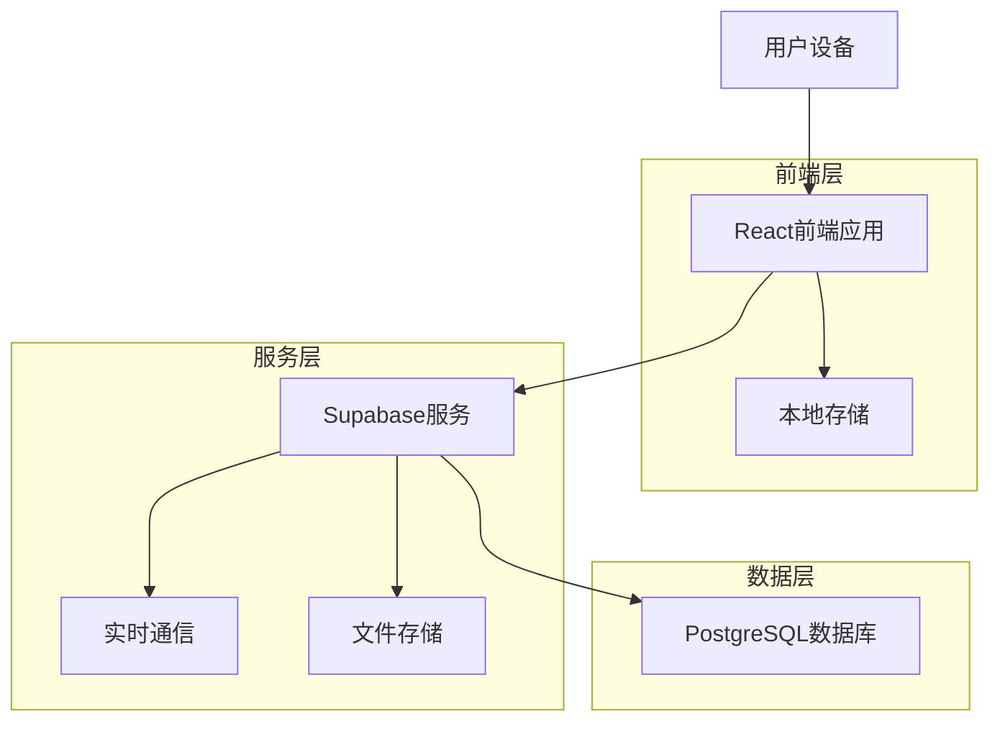
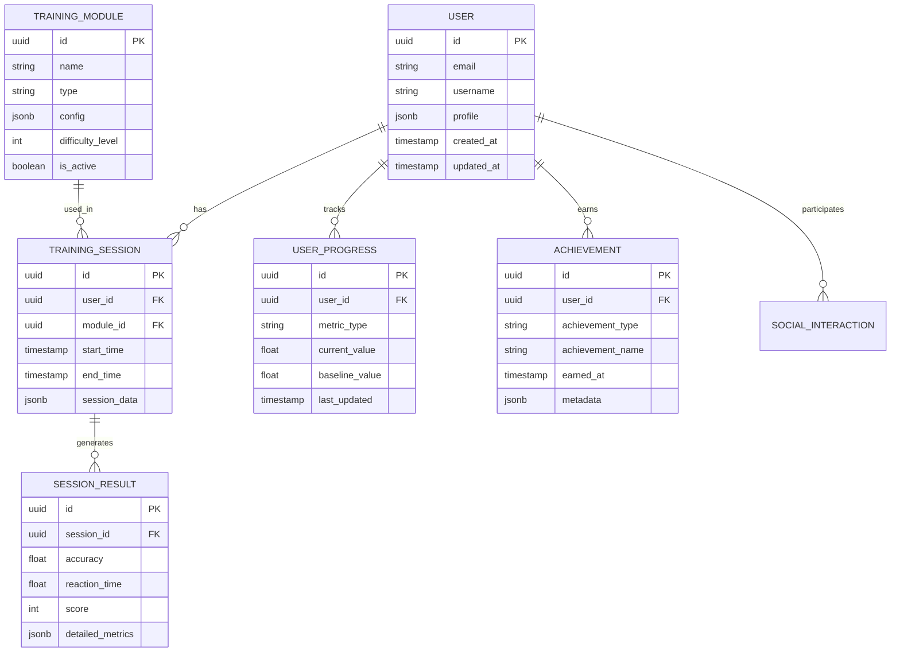

# 注意力训练模块产品需求文档

## 1. 产品概述

本文档针对注意力训练模块中的两个新项目进行全面的市场调研、产品设计和开发规划。核心目标是打造具有强用户粘性的注意力训练产品，通过科学的训练方法、游戏化设计和个性化体验，帮助用户提升注意力和认知能力，并促进长期使用。

基于现有的n-back游戏基础，我们将开发两个创新的注意力训练项目，填补市场空白，为用户提供更丰富、更有效的认知训练体验。

## 2. 市场调研分析

### 2.1 行业现状分析

#### 2.1.1 市场规模与发展趋势
认知训练和脑力训练市场正在快速增长，主要驱动因素包括：
- 人口老龄化带来的认知健康需求增长
- 学生群体对注意力提升的迫切需求
- 职场人士对工作效率和专注力的关注
- 移动互联网普及推动数字化训练方式发展

#### 2.1.2 竞争产品分析

**主要竞品：**
- **Lumosity**：市场领导者，拥有丰富的训练游戏库，但存在用户指导不足的问题
- **Peak**：界面精美，游戏多样化，但缺乏个性化训练方案
- **Elevate**：专注于实用技能训练，但在纯注意力训练方面相对薄弱
- **国内产品**：成长脑、爱海豚等，内容相对简单，用户体验有待提升

**竞品优势：**
- 成熟的游戏化设计
- 丰富的训练内容库
- 良好的视觉设计
- 科学的训练理论基础

**竞品劣势：**
- 用户留存率普遍较低（据观察，大部分用户难以长期坚持）
- 缺乏有效的用户指导和进度管理
- 个性化程度不足
- 训练效果反馈机制不完善
- 社交互动功能薄弱

### 2.2 目标用户群体分析

#### 2.2.1 主要用户群体

**学生群体（18-25岁）**
- 需求：提升学习专注力、备考效率
- 特点：时间相对充裕，接受新事物能力强
- 痛点：学习压力大，注意力容易分散

**职场人士（25-40岁）**
- 需求：提高工作效率，缓解工作压力
- 特点：时间碎片化，追求高效训练
- 痛点：工作繁忙，难以坚持长期训练

**中老年群体（40岁以上）**
- 需求：预防认知衰退，保持大脑活力
- 特点：学习能力相对较弱，需要更多指导
- 痛点：对数字产品不够熟悉，需要简单易用的界面

#### 2.2.2 用户痛点总结

1. **缺乏持续动机**：训练过程枯燥，难以长期坚持
2. **效果不明显**：缺乏科学的进度跟踪和效果评估
3. **个性化不足**：训练内容和难度无法适应个人水平
4. **指导缺失**：不知道如何制定训练计划和目标
5. **社交缺失**：缺乏与他人交流和竞争的机会

### 2.3 市场机会识别

1. **个性化训练方案**：基于AI算法提供定制化训练计划
2. **社交化训练**：引入好友竞争、团队挑战等社交元素
3. **科学化评估**：提供专业的认知能力评估和进步跟踪
4. **生活化应用**：将训练效果与日常生活场景结合
5. **多模态训练**：结合视觉、听觉、触觉等多种感官训练

## 3. 产品设计方案

### 3.1 产品定位

**核心定位**：科学化、个性化、游戏化的注意力训练平台

**产品愿景**：成为用户提升认知能力的首选工具，通过持续的科学训练帮助用户在学习、工作和生活中表现更出色。

### 3.2 两个新训练项目设计

#### 3.2.1 项目一：多维注意力挑战

**核心玩法**：
- 结合视觉、听觉、空间注意力的综合训练
- 动态难度调整，根据用户表现实时优化
- 多种训练模式：专注模式、分散注意力模式、切换注意力模式

**特色功能**：
- 3D空间注意力训练
- 多感官刺激结合
- 实时脑电波反馈（可选硬件支持）

#### 3.2.2 项目二：认知灵活性训练营

**核心玩法**：
- 任务切换训练
- 工作记忆与注意力结合训练
- 抑制控制能力提升

**特色功能**：
- 情境化训练场景（办公室、教室、驾驶等）
- 渐进式难度提升
- 个人认知档案建立

### 3.3 用户体验(UX)设计

#### 3.3.1 设计原则
- **简洁直观**：界面清晰，操作简单，降低学习成本
- **即时反馈**：训练过程中提供实时反馈和鼓励
- **渐进式引导**：新用户引导流程，逐步介绍功能
- **个性化适配**：根据用户水平和偏好调整界面和内容

#### 3.3.2 核心用户流程
1. **注册引导** → **能力评估** → **个性化方案生成** → **训练执行** → **进度跟踪** → **效果评估** → **方案调整**

### 3.4 用户界面(UI)设计

#### 3.4.1 视觉风格
- **色彩方案**：深蓝紫色主色调，配以薄荷绿、粉色、紫色等鲜艳辅助色
- **设计元素**：卡通化图标，柔和线条，渐变背景，星空主题
- **字体选择**：具有手绘感的现代字体，支持多语言
- **动画效果**：平滑的淡入淡出、缩放、旋转动画

#### 3.4.2 界面布局
- **卡片式设计**：训练模块采用卡片布局，便于浏览和选择
- **响应式设计**：适配手机、平板、桌面等多种设备
- **沉浸式训练界面**：训练时隐藏无关元素，专注训练内容

### 3.5 功能设计

#### 3.5.1 核心功能模块

**训练中心**
- 个性化训练计划
- 多种训练模式选择
- 实时难度调整
- 训练历史记录

**进度跟踪**
- 详细的能力评估报告
- 训练数据可视化
- 进步趋势分析
- 目标设定和达成跟踪

**社交互动**
- 好友系统和排行榜
- 团队挑战和竞赛
- 训练成果分享
- 社区讨论和经验交流

**个人中心**
- 用户档案管理
- 训练偏好设置
- 成就和徽章系统
- 学习资源库

#### 3.5.2 辅助功能
- 训练提醒和计划管理
- 多语言支持
- 无障碍访问支持
- 离线训练模式

### 3.6 激励机制设计

#### 3.6.1 积分系统
- **训练积分**：完成训练获得基础积分
- **表现积分**：根据训练表现获得额外积分
- **连续积分**：连续训练获得奖励积分
- **社交积分**：参与社交活动获得积分

#### 3.6.2 成就系统
- **训练成就**：完成特定训练目标
- **进步成就**：能力提升里程碑
- **社交成就**：社交互动相关成就
- **特殊成就**：节日活动、挑战赛等特殊成就

#### 3.6.3 等级系统
- **新手期**（1-10级）：基础训练，建立习惯
- **成长期**（11-30级）：技能提升，多样化训练
- **精进期**（31-50级）：高难度挑战，专业化训练
- **大师期**（51级以上）：创新训练，指导他人

#### 3.6.4 个性化反馈
- **实时鼓励**：训练过程中的正向反馈
- **进步提醒**：定期的能力提升通知
- **个性化建议**：基于数据分析的训练建议
- **里程碑庆祝**：重要进步节点的特殊庆祝

### 3.7 内容策略

#### 3.7.1 训练内容分层
- **基础层**：适合新手的简单训练
- **进阶层**：中等难度的综合训练
- **专家层**：高难度的专业训练
- **创新层**：实验性的前沿训练方法

#### 3.7.2 内容更新策略
- **定期更新**：每月新增训练内容
- **季节性内容**：结合节日和季节的特殊训练
- **用户生成内容**：鼓励用户创建和分享训练方案
- **专家合作**：与认知科学专家合作开发专业内容

### 3.8 个性化与适应性

#### 3.8.1 智能推荐系统
- **能力评估**：定期评估用户认知能力水平
- **学习偏好分析**：分析用户的训练偏好和习惯
- **动态调整**：根据表现实时调整训练难度和内容
- **目标导向**：根据用户目标推荐最适合的训练方案

#### 3.8.2 自适应训练算法
- **难度自适应**：根据正确率和反应时间调整难度
- **内容自适应**：根据用户弱项推荐针对性训练
- **时间自适应**：根据用户可用时间推荐合适的训练时长
- **情境自适应**：根据使用场景调整训练模式

## 4. 开发规划

### 4.1 技术选型

#### 4.1.1 前端技术栈
- **框架**：React 18 + TypeScript
- **样式**：Tailwind CSS 3 + Framer Motion（动画）
- **状态管理**：Zustand + React Query
- **构建工具**：Vite
- **UI组件库**：自定义组件库（基于设计系统）

#### 4.1.2 后端技术栈
- **数据库**：Supabase（PostgreSQL）
- **认证**：Supabase Auth
- **实时功能**：Supabase Realtime
- **文件存储**：Supabase Storage
- **API**：Supabase Edge Functions（必要时）

#### 4.1.3 数据分析与AI
- **用户行为分析**：自建分析系统
- **推荐算法**：基于协同过滤和内容推荐的混合算法
- **自适应算法**：基于强化学习的难度调整算法

### 4.2 系统架构设计

### 4.3 数据模型设计

#### 4.3.1 核心数据实体

### 4.4 开发路线图

#### 4.4.1 第一阶段：MVP开发（8-10周）

**Week 1-2：项目初始化与基础架构**
- 项目环境搭建
- 基础组件库开发
- 数据库设计与初始化
- 用户认证系统

**Week 3-4：核心训练模块开发**
- 多维注意力挑战基础版本
- 认知灵活性训练基础版本
- 训练数据收集与存储

**Week 5-6：用户界面与体验**
- 主界面设计与开发
- 训练界面优化
- 基础动画效果实现

**Week 7-8：数据分析与反馈**
- 基础数据分析功能
- 进度跟踪界面
- 简单的个性化推荐

**Week 9-10：测试与优化**
- 功能测试与bug修复
- 性能优化
- 用户体验测试

#### 4.4.2 第二阶段：功能完善（6-8周）

**Week 11-12：高级训练功能**
- 训练模块扩展
- 难度自适应算法
- 多模态训练支持

**Week 13-14：社交功能**
- 好友系统
- 排行榜功能
- 团队挑战

**Week 15-16：激励系统**
- 完整的积分系统
- 成就系统
- 等级系统

**Week 17-18：高级个性化**
- AI推荐算法优化
- 个性化训练计划
- 智能提醒系统

#### 4.4.3 第三阶段：优化与扩展（4-6周）

**Week 19-20：性能优化**
- 代码优化
- 数据库性能调优
- 缓存策略实施

**Week 21-22：高级功能**
- 离线模式支持
- 多设备同步
- 高级数据分析

**Week 23-24：发布准备**
- 最终测试
- 文档完善
- 部署准备

### 4.5 测试策略

#### 4.5.1 测试类型

**单元测试**
- 覆盖率目标：80%以上
- 重点测试：训练算法、数据处理、用户交互逻辑
- 工具：Jest + React Testing Library

**集成测试**
- API接口测试
- 数据库操作测试
- 第三方服务集成测试

**端到端测试**
- 关键用户流程测试
- 跨浏览器兼容性测试
- 移动端适配测试
- 工具：Playwright

**性能测试**
- 页面加载速度测试
- 训练模块响应时间测试
- 并发用户测试

**用户体验测试**
- 可用性测试
- A/B测试
- 用户反馈收集

#### 4.5.2 测试环境
- **开发环境**：本地开发测试
- **测试环境**：功能测试和集成测试
- **预生产环境**：性能测试和用户验收测试
- **生产环境**：监控和问题追踪

### 4.6 部署与运维

#### 4.6.1 部署策略
- **前端部署**：Vercel（自动化部署，CDN加速）
- **后端服务**：Supabase云服务
- **监控系统**：Sentry（错误监控）+ Google Analytics（用户行为分析）

#### 4.6.2 运维监控
- **性能监控**：页面加载时间、API响应时间
- **错误监控**：JavaScript错误、API错误
- **用户行为监控**：用户路径分析、功能使用统计
- **业务指标监控**：用户留存率、训练完成率、用户满意度

#### 4.6.3 数据备份与安全
- **数据备份**：Supabase自动备份 + 定期手动备份
- **安全措施**：HTTPS加密、数据脱敏、访问控制
- **隐私保护**：GDPR合规、用户数据匿名化

## 5. 风险评估与应对策略

### 5.1 技术风险
- **风险**：新技术栈学习成本
- **应对**：团队技术培训，逐步迁移

### 5.2 市场风险
- **风险**：竞品快速迭代
- **应对**：快速MVP验证，持续创新

### 5.3 用户风险
- **风险**：用户留存率低
- **应对**：强化激励机制，优化用户体验

### 5.4 资源风险
- **风险**：开发资源不足
- **应对**：合理规划开发优先级，分阶段交付

## 6. 成功指标定义

### 6.1 用户指标
- **用户获取**：月新增用户数 > 1000
- **用户活跃**：日活跃用户率 > 20%
- **用户留存**：7日留存率 > 40%，30日留存率 > 20%
- **用户参与**：平均训练时长 > 15分钟/天

### 6.2 产品指标
- **训练完成率** > 80%
- **用户满意度** > 4.5/5.0
- **功能使用率**：核心功能使用率 > 60%
- **错误率** < 1%

### 6.3 商业指标
- **用户生命周期价值**（LTV）
- **获客成本**（CAC）
- **收入增长率**（如有付费功能）

## 7. 总结

本产品需求文档为注意力训练模块的两个新项目提供了全面的设计和开发指导。通过深入的市场调研，我们识别了现有产品的不足和市场机会，设计了具有创新性和竞争力的产品方案。

**核心竞争优势：**
1. **科学化训练**：基于认知科学理论的训练方法
2. **个性化体验**：AI驱动的自适应训练系统
3. **游戏化设计**：提升用户参与度和留存率
4. **社交化互动**：增强用户粘性和传播效应
5. **数据驱动**：持续优化和改进产品体验

通过分阶段的开发计划和完善的测试策略，我们将确保产品的高质量交付。同时，通过持续的用户反馈收集和数据分析，不断优化产品功能和用户体验，最终实现用户长期使用和商业成功的双重目标。