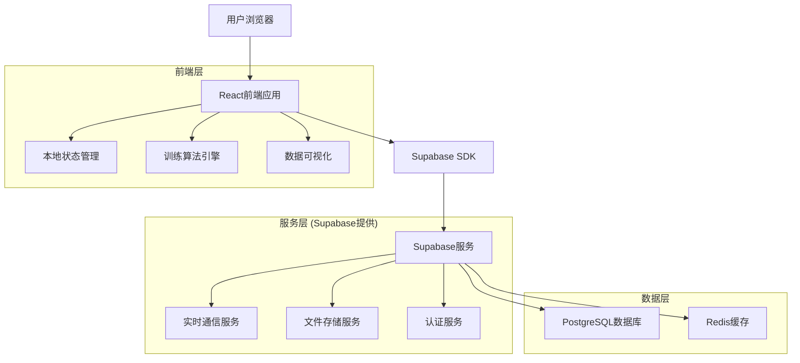
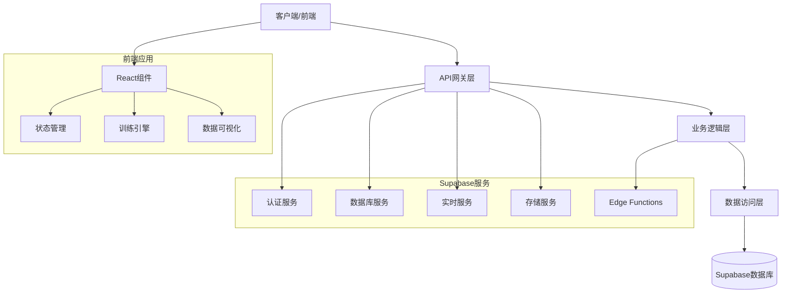
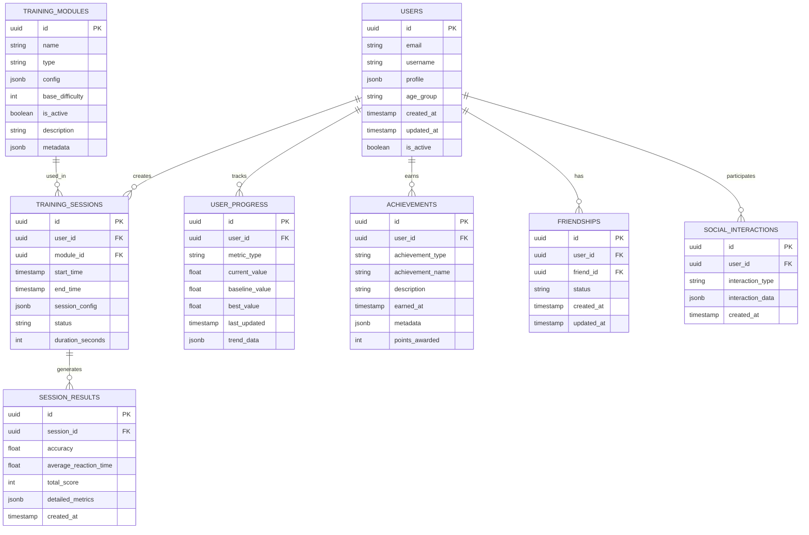

# 注意力训练模块技术架构文档

## 1. 架构设计



## 2. 技术描述

### 2.1 核心技术栈
- **前端**: React@18 + TypeScript + Tailwind CSS@3 + Vite
- **状态管理**: Zustand + React Query
- **动画**: Framer Motion
- **后端服务**: Supabase (认证、数据库、实时通信、存储)
- **数据库**: PostgreSQL (通过Supabase)
- **部署**: Vercel (前端) + Supabase Cloud (后端)

### 2.2 关键依赖库
- **UI组件**: 自定义组件库基于Headless UI
- **图表可视化**: Chart.js + React-Chartjs-2
- **音频处理**: Web Audio API
- **数学计算**: Math.js
- **日期处理**: date-fns
- **工具库**: Lodash-es

## 3. 路由定义

| 路由 | 用途 |
|------|------|
| / | 主页，展示训练模块概览和导航 |
| /login | 登录页面，用户认证 |
| /register | 注册页面，新用户注册 |
| /dashboard | 用户仪表板，显示训练进度和统计 |
| /training/multi-attention | 多维注意力挑战训练页面 |
| /training/cognitive-flexibility | 认知灵活性训练营页面 |
| /training/n-back | 现有的N-Back训练页面 |
| /progress | 进度跟踪页面，详细的能力分析 |
| /social | 社交功能页面，好友、排行榜、挑战 |
| /profile | 用户个人资料和设置页面 |
| /achievements | 成就和徽章展示页面 |

## 4. API定义

### 4.1 认证相关API

**用户注册**
```typescript
// Supabase Auth API
supabase.auth.signUp({
  email: string,
  password: string,
  options: {
    data: {
      username: string,
      age_group: string
    }
  }
})
```

**用户登录**
```typescript
supabase.auth.signInWithPassword({
  email: string,
  password: string
})
```

### 4.2 训练数据API

**创建训练会话**
```typescript
interface TrainingSession {
  user_id: string;
  module_id: string;
  start_time: string;
  session_config: {
    difficulty_level: number;
    training_type: 'multi-attention' | 'cognitive-flexibility' | 'n-back';
    duration_minutes: number;
  };
}

// 插入训练会话
supabase.from('training_sessions').insert(sessionData)
```

**保存训练结果**
```typescript
interface SessionResult {
  session_id: string;
  accuracy: number;
  reaction_time: number;
  score: number;
  detailed_metrics: {
    correct_responses: number;
    total_responses: number;
    average_response_time: number;
    difficulty_progression: number[];
  };
}

// 插入训练结果
supabase.from('session_results').insert(resultData)
```

### 4.3 用户进度API

**获取用户进度**
```typescript
// 查询用户进度数据
supabase
  .from('user_progress')
  .select('*')
  .eq('user_id', userId)
  .order('last_updated', { ascending: false })
```

**更新用户进度**
```typescript
interface UserProgress {
  user_id: string;
  metric_type: 'attention_span' | 'reaction_time' | 'accuracy' | 'cognitive_flexibility';
  current_value: number;
  baseline_value: number;
  improvement_percentage: number;
}

// 更新或插入进度数据
supabase.from('user_progress').upsert(progressData)
```

### 4.4 社交功能API

**获取排行榜**
```typescript
// 查询排行榜数据
supabase
  .from('leaderboard_view')
  .select('username, total_score, rank')
  .order('total_score', { ascending: false })
  .limit(100)
```

**好友系统**
```typescript
interface Friendship {
  user_id: string;
  friend_id: string;
  status: 'pending' | 'accepted' | 'blocked';
  created_at: string;
}

// 发送好友请求
supabase.from('friendships').insert(friendshipData)
```

## 5. 服务器架构图



## 6. 数据模型

### 6.1 数据模型定义



### 6.2 数据定义语言

**用户表 (users)**
```sql
-- 创建用户表
CREATE TABLE users (
    id UUID PRIMARY KEY DEFAULT gen_random_uuid(),
    email VARCHAR(255) UNIQUE NOT NULL,
    username VARCHAR(50) UNIQUE NOT NULL,
    profile JSONB DEFAULT '{}',
    age_group VARCHAR(20) DEFAULT 'adult',
    created_at TIMESTAMP WITH TIME ZONE DEFAULT NOW(),
    updated_at TIMESTAMP WITH TIME ZONE DEFAULT NOW(),
    is_active BOOLEAN DEFAULT true
);

-- 创建索引
CREATE INDEX idx_users_email ON users(email);
CREATE INDEX idx_users_username ON users(username);
CREATE INDEX idx_users_created_at ON users(created_at DESC);

-- 启用行级安全
ALTER TABLE users ENABLE ROW LEVEL SECURITY;

-- 创建安全策略
CREATE POLICY "Users can view own profile" ON users
    FOR SELECT USING (auth.uid() = id);

CREATE POLICY "Users can update own profile" ON users
    FOR UPDATE USING (auth.uid() = id);
```

**训练模块表 (training_modules)**
```sql
-- 创建训练模块表
CREATE TABLE training_modules (
    id UUID PRIMARY KEY DEFAULT gen_random_uuid(),
    name VARCHAR(100) NOT NULL,
    type VARCHAR(50) NOT NULL,
    config JSONB DEFAULT '{}',
    base_difficulty INTEGER DEFAULT 1,
    is_active BOOLEAN DEFAULT true,
    description TEXT,
    metadata JSONB DEFAULT '{}',
    created_at TIMESTAMP WITH TIME ZONE DEFAULT NOW()
);

-- 创建索引
CREATE INDEX idx_training_modules_type ON training_modules(type);
CREATE INDEX idx_training_modules_active ON training_modules(is_active);

-- 插入初始数据
INSERT INTO training_modules (name, type, config, base_difficulty, description) VALUES
('多维注意力挑战', 'multi-attention', '{"modes": ["visual", "auditory", "spatial"], "max_difficulty": 10}', 1, '结合视觉、听觉、空间注意力的综合训练'),
('认知灵活性训练营', 'cognitive-flexibility', '{"scenarios": ["office", "classroom", "driving"], "max_difficulty": 8}', 1, '任务切换和认知灵活性提升训练'),
('N-Back记忆训练', 'n-back', '{"max_n": 5, "stimuli_types": ["visual", "auditory"]}', 1, '工作记忆和注意力结合训练');
```

**训练会话表 (training_sessions)**
```sql
-- 创建训练会话表
CREATE TABLE training_sessions (
    id UUID PRIMARY KEY DEFAULT gen_random_uuid(),
    user_id UUID REFERENCES users(id) ON DELETE CASCADE,
    module_id UUID REFERENCES training_modules(id),
    start_time TIMESTAMP WITH TIME ZONE DEFAULT NOW(),
    end_time TIMESTAMP WITH TIME ZONE,
    session_config JSONB DEFAULT '{}',
    status VARCHAR(20) DEFAULT 'active',
    duration_seconds INTEGER
);

-- 创建索引
CREATE INDEX idx_training_sessions_user_id ON training_sessions(user_id);
CREATE INDEX idx_training_sessions_module_id ON training_sessions(module_id);
CREATE INDEX idx_training_sessions_start_time ON training_sessions(start_time DESC);

-- 启用行级安全
ALTER TABLE training_sessions ENABLE ROW LEVEL SECURITY;

-- 创建安全策略
CREATE POLICY "Users can manage own sessions" ON training_sessions
    FOR ALL USING (auth.uid() = user_id);
```

**会话结果表 (session_results)**
```sql
-- 创建会话结果表
CREATE TABLE session_results (
    id UUID PRIMARY KEY DEFAULT gen_random_uuid(),
    session_id UUID REFERENCES training_sessions(id) ON DELETE CASCADE,
    accuracy FLOAT CHECK (accuracy >= 0 AND accuracy <= 1),
    average_reaction_time FLOAT CHECK (average_reaction_time > 0),
    total_score INTEGER DEFAULT 0,
    detailed_metrics JSONB DEFAULT '{}',
    created_at TIMESTAMP WITH TIME ZONE DEFAULT NOW()
);

-- 创建索引
CREATE INDEX idx_session_results_session_id ON session_results(session_id);
CREATE INDEX idx_session_results_created_at ON session_results(created_at DESC);
CREATE INDEX idx_session_results_score ON session_results(total_score DESC);

-- 启用行级安全
ALTER TABLE session_results ENABLE ROW LEVEL SECURITY;

-- 创建安全策略
CREATE POLICY "Users can view own results" ON session_results
    FOR SELECT USING (
        EXISTS (
            SELECT 1 FROM training_sessions ts 
            WHERE ts.id = session_results.session_id 
            AND ts.user_id = auth.uid()
        )
    );
```

**用户进度表 (user_progress)**
```sql
-- 创建用户进度表
CREATE TABLE user_progress (
    id UUID PRIMARY KEY DEFAULT gen_random_uuid(),
    user_id UUID REFERENCES users(id) ON DELETE CASCADE,
    metric_type VARCHAR(50) NOT NULL,
    current_value FLOAT NOT NULL,
    baseline_value FLOAT,
    best_value FLOAT,
    last_updated TIMESTAMP WITH TIME ZONE DEFAULT NOW(),
    trend_data JSONB DEFAULT '[]',
    UNIQUE(user_id, metric_type)
);

-- 创建索引
CREATE INDEX idx_user_progress_user_id ON user_progress(user_id);
CREATE INDEX idx_user_progress_metric_type ON user_progress(metric_type);
CREATE INDEX idx_user_progress_updated ON user_progress(last_updated DESC);

-- 启用行级安全
ALTER TABLE user_progress ENABLE ROW LEVEL SECURITY;

-- 创建安全策略
CREATE POLICY "Users can manage own progress" ON user_progress
    FOR ALL USING (auth.uid() = user_id);
```

**成就表 (achievements)**
```sql
-- 创建成就表
CREATE TABLE achievements (
    id UUID PRIMARY KEY DEFAULT gen_random_uuid(),
    user_id UUID REFERENCES users(id) ON DELETE CASCADE,
    achievement_type VARCHAR(50) NOT NULL,
    achievement_name VARCHAR(100) NOT NULL,
    description TEXT,
    earned_at TIMESTAMP WITH TIME ZONE DEFAULT NOW(),
    metadata JSONB DEFAULT '{}',
    points_awarded INTEGER DEFAULT 0
);

-- 创建索引
CREATE INDEX idx_achievements_user_id ON achievements(user_id);
CREATE INDEX idx_achievements_type ON achievements(achievement_type);
CREATE INDEX idx_achievements_earned_at ON achievements(earned_at DESC);

-- 启用行级安全
ALTER TABLE achievements ENABLE ROW LEVEL SECURITY;

-- 创建安全策略
CREATE POLICY "Users can view own achievements" ON achievements
    FOR SELECT USING (auth.uid() = user_id);
```

**好友关系表 (friendships)**
```sql
-- 创建好友关系表
CREATE TABLE friendships (
    id UUID PRIMARY KEY DEFAULT gen_random_uuid(),
    user_id UUID REFERENCES users(id) ON DELETE CASCADE,
    friend_id UUID REFERENCES users(id) ON DELETE CASCADE,
    status VARCHAR(20) DEFAULT 'pending' CHECK (status IN ('pending', 'accepted', 'blocked')),
    created_at TIMESTAMP WITH TIME ZONE DEFAULT NOW(),
    updated_at TIMESTAMP WITH TIME ZONE DEFAULT NOW(),
    UNIQUE(user_id, friend_id),
    CHECK (user_id != friend_id)
);

-- 创建索引
CREATE INDEX idx_friendships_user_id ON friendships(user_id);
CREATE INDEX idx_friendships_friend_id ON friendships(friend_id);
CREATE INDEX idx_friendships_status ON friendships(status);

-- 启用行级安全
ALTER TABLE friendships ENABLE ROW LEVEL SECURITY;

-- 创建安全策略
CREATE POLICY "Users can manage own friendships" ON friendships
    FOR ALL USING (auth.uid() = user_id OR auth.uid() = friend_id);
```

**创建视图和函数**
```sql
-- 创建排行榜视图
CREATE VIEW leaderboard_view AS
SELECT 
    u.username,
    u.id as user_id,
    COALESCE(SUM(sr.total_score), 0) as total_score,
    COUNT(ts.id) as total_sessions,
    RANK() OVER (ORDER BY COALESCE(SUM(sr.total_score), 0) DESC) as rank
FROM users u
LEFT JOIN training_sessions ts ON u.id = ts.user_id
LEFT JOIN session_results sr ON ts.id = sr.session_id
WHERE u.is_active = true
GROUP BY u.id, u.username
ORDER BY total_score DESC;

-- 创建更新用户进度的函数
CREATE OR REPLACE FUNCTION update_user_progress(
    p_user_id UUID,
    p_metric_type VARCHAR,
    p_new_value FLOAT
) RETURNS VOID AS $$
BEGIN
    INSERT INTO user_progress (user_id, metric_type, current_value, baseline_value, best_value)
    VALUES (p_user_id, p_metric_type, p_new_value, p_new_value, p_new_value)
    ON CONFLICT (user_id, metric_type)
    DO UPDATE SET
        current_value = p_new_value,
        best_value = GREATEST(user_progress.best_value, p_new_value),
        last_updated = NOW(),
        trend_data = user_progress.trend_data || jsonb_build_object('value', p_new_value, 'timestamp', NOW());
END;
$$ LANGUAGE plpgsql;
```

## 7. 前端组件架构

### 7.1 组件层次结构

```
App
├── Layout
│   ├── Header
│   ├── Navigation
│   └── Footer
├── Pages
│   ├── HomePage
│   ├── LoginPage
│   ├── DashboardPage
│   ├── TrainingPages
│   │   ├── MultiAttentionTraining
│   │   ├── CognitiveFlexibilityTraining
│   │   └── NBackTraining
│   ├── ProgressPage
│   ├── SocialPage
│   └── ProfilePage
├── Components
│   ├── TrainingEngine
│   ├── ProgressCharts
│   ├── AchievementBadges
│   ├── Leaderboard
│   └── SocialFeatures
└── Hooks
    ├── useTrainingSession
    ├── useUserProgress
    ├── useAchievements
    └── useSocialFeatures
```

### 7.2 状态管理架构

```typescript
// 全局状态结构
interface AppState {
  user: UserState;
  training: TrainingState;
  progress: ProgressState;
  social: SocialState;
  ui: UIState;
}

// 用户状态
interface UserState {
  currentUser: User | null;
  isAuthenticated: boolean;
  profile: UserProfile;
  preferences: UserPreferences;
}

// 训练状态
interface TrainingState {
  currentSession: TrainingSession | null;
  availableModules: TrainingModule[];
  sessionHistory: TrainingSession[];
  currentResults: SessionResult[];
}

// 进度状态
interface ProgressState {
  metrics: UserProgress[];
  achievements: Achievement[];
  trends: ProgressTrend[];
  goals: UserGoal[];
}
```

## 8. 性能优化策略

### 8.1 前端优化
- **代码分割**: 使用React.lazy()和Suspense进行路由级别的代码分割
- **组件优化**: 使用React.memo()和useMemo()优化重渲染
- **图片优化**: 使用WebP格式，实现懒加载
- **缓存策略**: 使用React Query进行数据缓存和同步

### 8.2 数据库优化
- **索引优化**: 为常用查询字段创建合适的索引
- **查询优化**: 使用Supabase的查询优化功能
- **数据分页**: 实现高效的分页查询
- **连接池**: 利用Supabase的连接池管理

### 8.3 网络优化
- **CDN加速**: 使用Vercel的全球CDN
- **压缩**: 启用Gzip/Brotli压缩
- **HTTP/2**: 利用HTTP/2的多路复用特性
- **预加载**: 关键资源的预加载策略

## 9. 安全考虑

### 9.1 认证安全
- 使用Supabase Auth的安全认证机制
- 实施行级安全(RLS)策略
- JWT令牌的安全管理
- 密码强度要求和加密存储

### 9.2 数据安全
- 敏感数据加密存储
- API访问权限控制
- 输入验证和SQL注入防护
- HTTPS强制使用

### 9.3 隐私保护
- 用户数据匿名化处理
- GDPR合规性考虑
- 数据最小化原则
- 用户数据导出和删除功能

## 10. 监控和日志

### 10.1 应用监控
- **错误监控**: 使用Sentry进行错误追踪
- **性能监控**: 监控页面加载时间和API响应时间
- **用户行为**: 使用Google Analytics追踪用户行为
- **实时监控**: Supabase Dashboard实时监控

### 10.2 业务指标监控
- 用户注册和活跃度
- 训练完成率和用户留存
- 功能使用统计
- 错误率和性能指标

这个技术架构文档为注意力训练模块的开发提供了全面的技术指导，确保系统的可扩展性、可维护性和高性能。通过合理的架构设计和技术选型，我们将能够构建一个稳定、高效的训练平台。